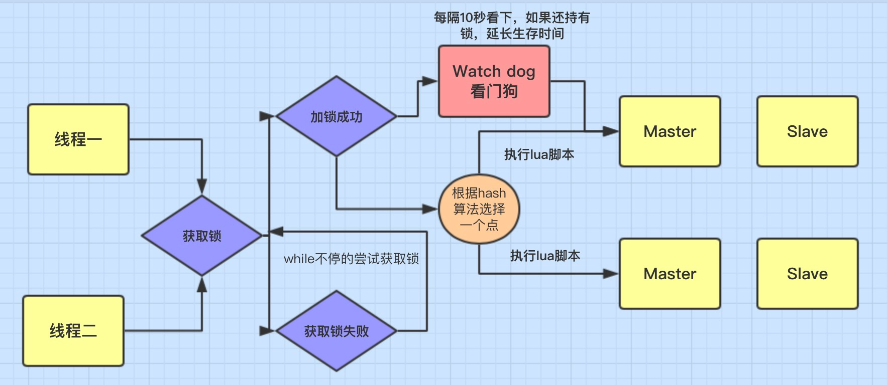
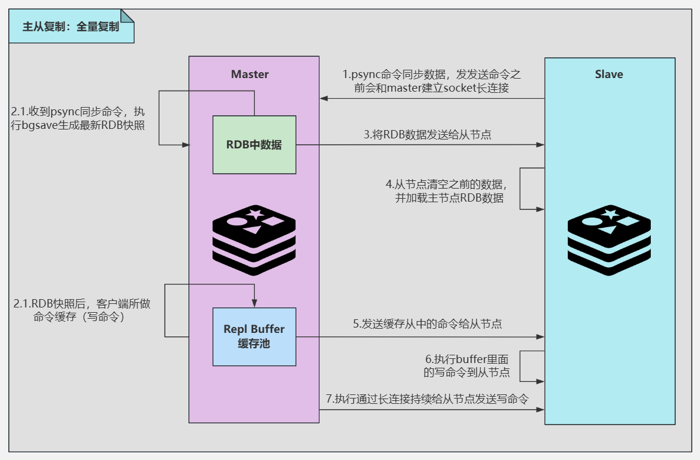
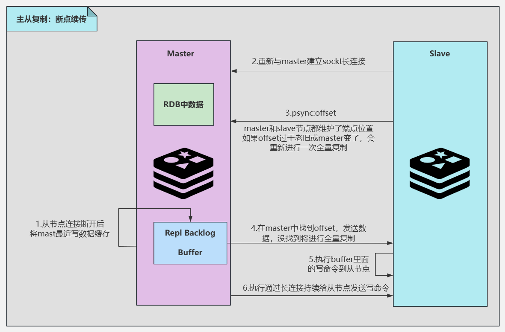
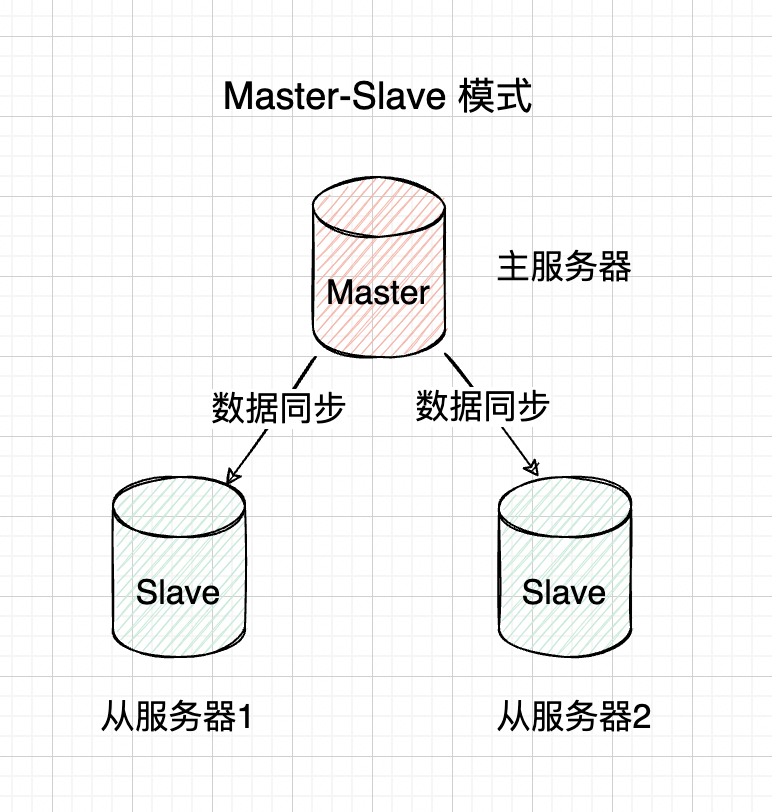
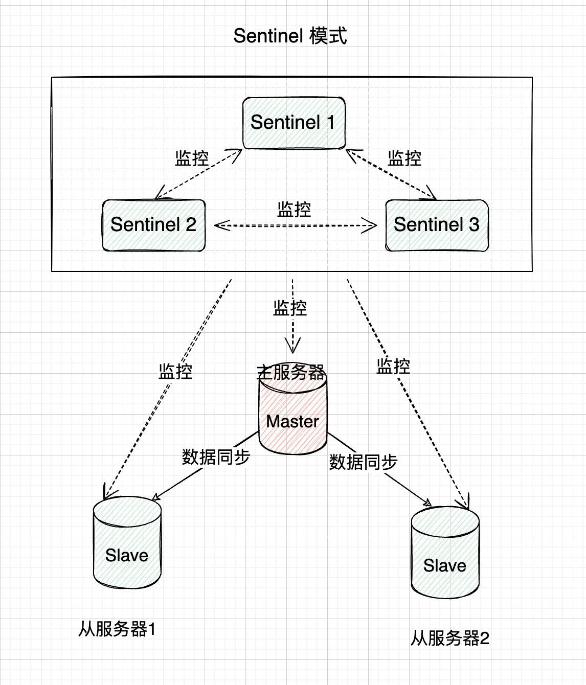

# Redis

官网地址：[https://redis.io/](https://redis.io/)

源码地址：[https://github.com/redis](https://github.com/redis)

## 一、Redis数据结构

**基础类型**： <RouteLink to="/interview/2_cache.md#六、redis-的常用数据结构有哪些">
java总结-缓存：Redis-常用的数据结构</RouteLink>

### 1、HyperLogLog

- 用于 **基数统计**（比如：统计网站独立访问人数UV）。
- 特点是：占用极小的内存（12KB），可以近似统计数十亿个数据元素，误差在 0.81% 左右。
- 适用场景：
    - 统计用户访问量
    - 活跃用户去重
    - 商品浏览量去重

- 典型命令：`PFADD`, `PFCOUNT`, `PFMERGE`

---

### 2、Bitmap

- 位图数据结构，用于按位存储数据，适合用来快速记录、统计、判断海量数据。
- 适用场景：
    - 签到功能（某天是否签到）
    - 活跃状态标记（某个用户是否在线）
    - 性能极佳，适合批量快速统计。

- 典型命令：`SETBIT`, `GETBIT`, `BITCOUNT`

---

### 3、GEO

- Redis 提供的地理位置存储和检索能力，基于 SortedSet 底层实现。
- 适用场景：
    - 附近的人、附近的店
    - 基于位置的服务（LBS）

- 典型命令：`GEOADD`, `GEORADIUS`, `GEODIST`

---

### 4、Stream

- Redis 5.0 新增的数据类型，支持**消息队列**场景。
- 相比 List 更强大，天然支持：
    - 消息持久化
    - 消息确认机制（ACK）
    - 消费组（Consumer Group）模式，支持水平扩展
- 适用场景：
    - 异步解耦
    - 消息流处理
    - 任务分发系统

- 典型命令：`XADD`, `XREAD`, `XGROUP`

## 二、深入 缓存淘汰策略

- Redis 提供多种淘汰策略，如：
    - `noeviction`：达到最大内存时不再写入
    - `allkeys-lru`：所有 key 中淘汰最近最少使用的
    - `volatile-lru`：只在设置了过期时间的 key 中淘汰 LRU 的
- 推荐配图 + 命令演示，帮助理解。

## 三、深入 持久化机制

详见：[Redis 官方持久化方案](https://redis.io/docs/latest/operate/oss_and_stack/management/persistence/)

- RDB 和 AOF 两种机制
    - 优劣对比、适用场景
    - 如何同时开启
- 建议加入图解流程、关键配置项说明

## 四、Redis线程模型

介绍线程模型的内容...

## 五、Redis分布式锁

为了更好的理解分布式锁的原理，我这边自己画张图通过这张图来分析：



### 1、加锁机制

线程去获取锁，获取成功: 执行 lua脚本，保存数据到 redis数据库。

线程去获取锁，获取失败: 一直通过 while循环尝试获取锁，获取成功后，执行 lua脚本，保存数据到 redis数据库。

### 2、Watch dog自动延期机制

在一个分布式环境下，假如一个线程获得锁后，突然服务器宕机了，那么这个时候在一定时间后这个锁会自动释放，你也
可以设置锁的有效时间(不设置默认30秒），这样的目的主要是防止死锁的发生。

但在实际开发中会有下面一种情况:

```bash
//设置锁1秒过期
redissonLock.lock("redisson",1);
/**
 * 业务逻辑需要咨询2秒
 */
redissonLock.release("redisson");

/**
 * 线程1 进来获得锁后，线程一切正常并没有宕机，但它的业务逻辑需要执行2秒，这就会有个问题，
 * 在 线程1 执行1秒后,这个锁就自动过期了，那么这个时候 线程2 进来了。那么就存在 线程1和线程2 
 * 同时在这段业务逻辑里执行代码，这当然是不合理的。而且如果是这种情况，那么在解锁时系统会抛异常，
 * 因为解锁和加锁已经不是同一线程了，具体后面代码演示。
 */
```

所以这个时候看门狗就出现了，它的作用就是 线程1 业务还没有执行完，时间就过了，线程1 还想持有锁的话，就会启动一个 watch
dog后台线程，不断的延长锁 key的生存时间。

::: tip
注意：正常这个看门狗线程是不启动的，还有就是这个看门狗启动后对整体性能也会有一定影响，所以**不建议开启看门狗**。
:::

### 3、Redis lua脚本

::: warning
Todo: to be continue...
:::

## 六、Redis主从复制

### 1、全量复制



### 2、断点续传



## 七、Redis 集群

### 1、Redis 集群分类


### 2、Redis 集群搭建

#### 主从模式方案



- 部署实测：Todo

#### 哨兵模式方案：



-

部署实测：[三台 Centos7.9 中 Docker 部署 Redis 哨兵模式](https://blog.csdn.net/weixin_43108539/article/details/145148482)

#### 集群模式方案：


-

部署实测：[三台 Centos7.9 中 Docker 部署 Redis 集群模式](https://blog.csdn.net/weixin_43108539/article/details/145098017)

## 八、Redis 集群同步

Todo

## 九、Redis 性能优化

## 十、监控与运维

- 常见工具：RedisInsight、Prometheus + Grafana、阿里云控制台
- 数据指标：命中率、连接数、慢查询、内存使用率等
- 可贴图、提供实际界面截图更生动

## 十一、缓存一致性

[https://cloud.tencent.com/developer/article/1932934](https://cloud.tencent.com/developer/article/1932934)
