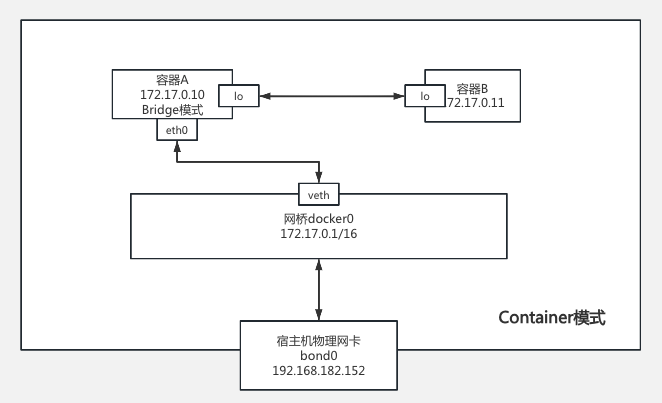
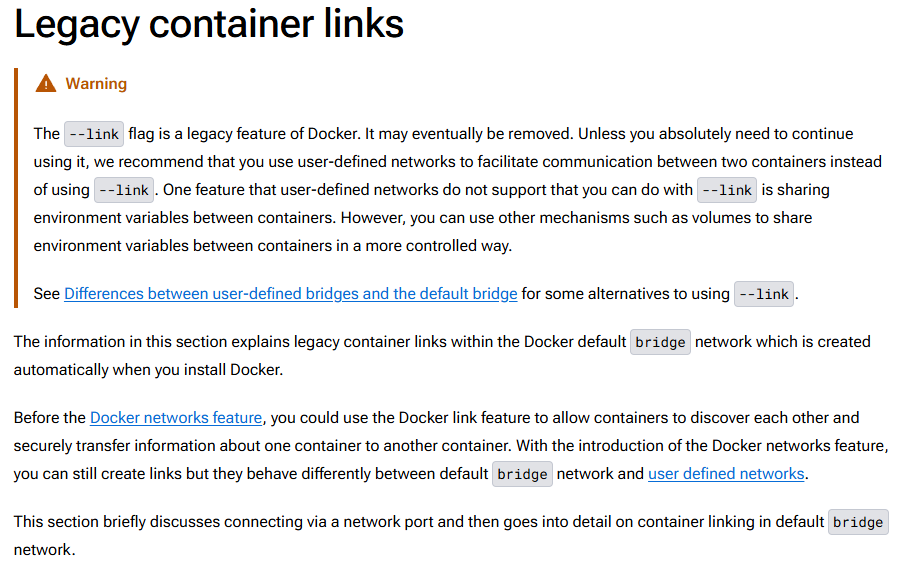

# Docker

## 一、Docker 镜像问题

::: tip
2024年6月开始，国内的常用 daemon.json 地址失效
:::

### 1、可用网址汇总

点击下方地址查看教程：

[https://1ms.run](https://1ms.run)

[https://xuanyuan.me/](https://xuanyuan.me/)

### 2、常用解决方案

#### 2.1、魔法下载后，手动上传（最笨方案）

::: warning
这是本人开始的思路，最终发现docker hub 并不支持此方案，除非使用 **Docker Registry** 进行交互来获得镜像层的内容并手动下载，但这种方法复杂且不常用
:::

#### 2.2、基于基线环境重新导入

文如其意，直接使用正式环境中已经存在的镜像，随后将 docker image 导出，再次导入即可；

#### 2.3、魔法代理方式

- VMware 中的 Docker 使用魔法方式

::: tip 必要前提条件
Vmware使用NAT模式，保证主机和虚拟机在一个局域网下
:::

[Clash](https://clashcn.com/) 的配置如下：


::: tip 建议
设置完成后，建议清空 daemon.json 内容，当然也可以保留（不过会使得Docker去所有的daemon地址搜索，降低 pull 速度）
:::

- Hyper-V 中的Docker使用魔法方式

使用clash，保证和 Hyper-V 宿主机在同个局域网即可，原理与 **VMware** 相同

- Docker直接使用代理方式实现

::: tip Todo
使用指定地址的代理实现，目前只是构思阶段，未完待续
:::

## 二、Docker 网络详解

默认情况下，**Docker0**为默认新增的**Bridge**网络，**Docker0**就是桥，将其所有的container链接起来，Docker的container可以直接访问外部网络，
内部之间的网络也是可以ping通的（默认不能ping主机名）；

### 1、Bridge


### 2、Host

注意：此模式下，各个容器不存在IP地址，只能通过端口或其他机制进行通信；


### 3、None

内部容器，没有网卡、路由、防火墙、IP、网关，端口等

### 4、Container

bridge和Host模式的结合体，存在Docker0网络，后续指定其网关；



::: warning 注意
这种方式官方已不推荐使用，并且在未来版本可能会被移除，所以这里不作为重点讲解，感兴趣可自行了解。

官网警告信息：[https://docs.docker.com/network](https://docs.docker.com/network)
:::



好的，下面是对你博客大纲中“**三、Docker 常用命令**” 和 “**四、Docker Compose**” 两节内容的详细补充：

## 三、Docker 常用命令

### 1. 镜像相关

```bash
# 查看本地镜像
docker images

# 搜索镜像
docker search nginx

# 拉取镜像
docker pull nginx:latest

# 删除镜像
docker rmi nginx
```

### 2. 容器相关

```bash
# 查看正在运行的容器
docker ps

# 查看所有容器（包括已停止）
docker ps -a

# 创建并启动容器（后台运行）
docker run -d --name my-nginx -p 8080:80 nginx

# 创建并进入交互式容器
docker run -it --name my-centos centos /bin/bash

# 停止容器
docker stop my-nginx

# 启动已停止的容器
docker start my-nginx

# 删除容器
docker rm my-nginx

# 查看容器日志
docker logs my-nginx

# 查看容器内的进程
docker top my-nginx

# 进入运行中的容器
docker exec -it my-nginx /bin/bash
```

### 3. 网络命令

```bash
# 查看网络
docker network ls

# 查看容器所属网络详情
docker network inspect bridge
```

### 4. 数据卷命令

```bash
# 创建数据卷
docker volume create mydata

# 查看数据卷
docker volume ls

# 删除数据卷
docker volume rm mydata
```

## 四、Docker Compose 简介与使用

### 1. 什么是 Docker Compose？

Docker Compose 是一个用于**定义和运行多个容器应用**的工具，通过一个 `docker-compose.yml` 文件来配置服务、网络、数据卷等。

适用于微服务、多容器应用场景。

### 2. 安装 Docker Compose

如果你使用 Docker Desktop，则 Compose 已自带；
Linux 可使用如下命令安装（以最新版本为例）：

```bash
sudo curl -L "https://github.com/docker/compose/releases/latest/download/docker-compose-$(uname -s)-$(uname -m)" -o /usr/local/bin/docker-compose
sudo chmod +x /usr/local/bin/docker-compose
```

### 3. 示例 `docker-compose.yml`

```yaml
version: '3.8'
services:
  web:
    image: nginx
    ports:
      - "8080:80"
    volumes:
      - ./html:/usr/share/nginx/html

  redis:
    image: redis:alpine
```

运行命令：

- **重要前提**：当前目录 存在 docker-compose.yml

```bash
# 构建 全部服务 并启动服务
docker-compose up -d

# 构建 指定多个服务 并启动服务
docker-compose up -d 服务名1 服务名2

# 停止服务
docker-compose down

# 查看服务状态
docker-compose ps

# 查看服务日志
docker-compose logs

```

### 4. 常用参数总结

| 命令                                  | 说明                            |
|-------------------------------------|-------------------------------|
| `docker-compose up -d`              | 后台启动所有服务                      |
| `docker-compose down`               | 停止并删除所有服务容器                   |
| `docker-compose ps`                 | 查看服务状态                        |
| `docker-compose logs`               | 查看服务日志                        |
| `docker-compose exec 服务名 /bin/bash` | 进入容器                          |
| `docker-compose build`              | 手动构建镜像（配合 Dockerfile 使用）      |
| `docker-compose -f yml文件名`          | 运行指定的，非名为docker-compose.yml文件 |

---

### 5. Docker Compose 应用场景

* 微服务系统（如 Web + DB + 缓存）
* 多环境部署（dev/test/prod）
* 一键本地开发环境搭建
* GitLab CI/CD 中作为服务依赖
