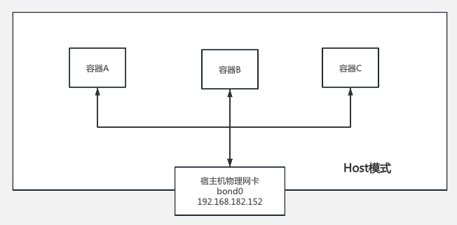

# Docker

## 一、Docker 镜像问题

::: tip
2024年6月开始，国内的常用 daemon.json 地址失效
:::

### 1、可用网址汇总

点击下方地址查看教程：

[https://1ms.run](https://1ms.run)

[https://xuanyuan.me/](https://xuanyuan.me/)

### 2、常用解决方案

#### 2.1、魔法下载后，手动上传（最笨方案）

::: warning
这是本人开始的思路，最终发现docker hub 并不支持此方案，除非使用 **Docker Registry** 进行交互来获得镜像层的内容并手动下载，但这种方法复杂且不常用
:::

#### 2.2、基于基线环境重新导入

文如其意，直接使用正式环境中已经存在的镜像，随后将 docker image 导出，再次导入即可；

#### 2.3、魔法代理方式直接下载

- VMware 中的 Docker 使用魔法方式

::: tip 必要前提条件
Vmware使用NAT模式，保证主机和虚拟机在一个局域网下
:::

[Clash](https://clashcn.com/) 的配置如下：

::: tip 建议
设置完成后，建议清空 daemon.json 内容，当然也可以保留（不过会使得Docker去所有的daemon地址搜索，降低 pull 速度）
:::

- Hyper-V 中的Docker使用魔法方式

使用clash，保证和 Hyper-V 宿主机在同个局域网即可，原理与 **VMware** 相同

- Docker直接使用代理方式实现

::: tip todo
使用指定地址的代理实现，目前只是构思阶段，未完待续
:::

## 二、Docker 网络详解

默认情况下，**Docker0**为默认新增的**Bridge**网络，**Docker0**就是桥，将其所有的container链接起来，Docker的container可以直接访问外部网络，
内部之间的网络也是可以ping通的（默认不能ping主机名）；

### 1、Bridge

### 2、Host

注意：此模式下，各个容器不存在IP地址，只能通过端口或其他机制进行通信；

### 3、None

内部容器，没有网卡、路由、防火墙、IP、网关，端口等

### 4、Container

bridge和Host模式的结合体，存在Docker0网络，后续指定其网关；

::: warning 注意
这种方式官方已不推荐使用，并且在未来版本可能会被移除，所以这里不作为重点讲解，感兴趣可自行了解。

官网警告信息：[https://docs.docker.com/network](https://docs.docker.com/network)
:::

