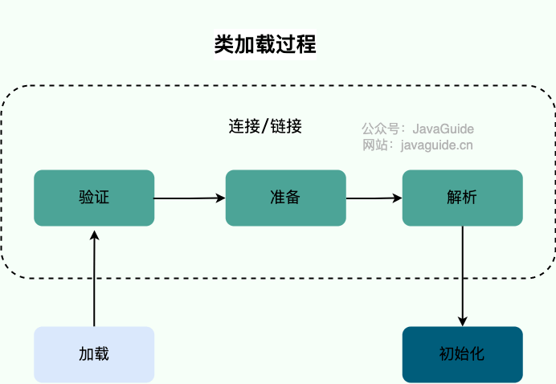
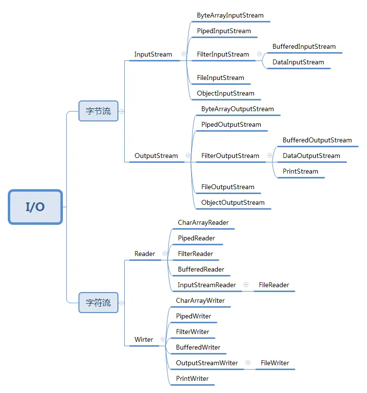
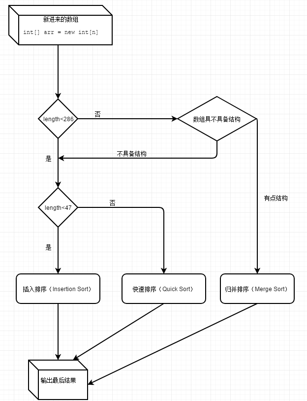
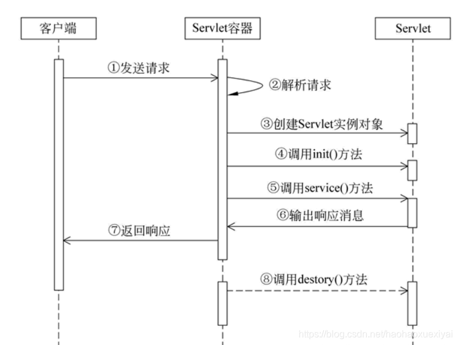

# Java总结-Java

## 一、JAVA中的几种基本数据类型

Java语言中一共提供了8种原始的数据类型（byte，short，int，long，float，double，char，boolean），这些数据类型不是对象，
而是Java语言中不同于类的特殊类型，这些基本类型的数据变量在声明之后就会立刻在栈上被分配内存空间。

除了这8种基本的数据类型外， 其他类型都是引用类型（例如类、接口、数组等），引用类型类似于C++中的引用或指针的概念，它以特殊的方式指向对象实体，
此类变量在声明时不会被分配内存空间，只是存储了一个内存地址而已。

| 数据类型    | 字节长度	 | 范围	                | 默认值        | 	包装类       |
|---------|-------|--------------------|------------|------------|
| int     | 	4	   | (-2^31~2^31-1)     | 	0         | 	Integer   |
| short   | 	2	   | [-32768,32767]	    | 0          | 	Short     |            |
| byte    | 	1    | 	[-128,127]        | 	0         | 	Byte      |
| long    | 8	    | (-2^63~2^63-1)     | 	0L或0l     | 	Long      |
| double  | 	8    | 64位IEEE754双精度范围    | 0.0        | 	Double    |
| float   | 	4    | 	32位IEEE754单精度范围   | 	0.0F或0.0f | 	Float     |
| char    | 	2    | 	Unicode [0,65535] | 	u0000     | 	Character |
| boolean | 	1    | 	true和false        | 	flase     | 	Boolean   |

::: tip 抖音点赞 负数原因

点赞数通常存储在数据库的 int 或 bigint 类型字段中。如果某条视频的点赞数超出数据存储范围，可能会发生溢出，导致数值变为负数。例如：

- 若点赞数使用 int（最大值约 21 亿），超出范围后可能变成负数；

- 当变成负数时，继续累加，后续可能再次负值，形成int环；

- 处理不当的数据类型转换（如 int 转 short）也可能导致异常。

  :::

## 二、String 类能被继承吗，为何不可变？

### **1. String 类不能被继承**
- **原因**: `String` 类被声明为 `final`，即：
  ```java
  public final class String { ... }
  ```
  - `final` 修饰的类不能被继承。
  
  - 这是为了确保 `String` 的不可变性和安全性，防止子类修改其行为。

### **2. String 类的不可变性**
`String` 类的不可变性是通过以下设计实现的：

1. **字符数组被声明为 `final`**:
   ```java
   private final byte[] value;
   ``` 
    - `final` 修饰的 `byte[]` 表示引用不可变（即不能指向其他数组），但数组内容本身是可以修改的。
  
2. **数组内容的保护**:
   - `String` 类没有提供任何方法修改 `value` 数组的内容。

   - 所有修改操作（如 `substring`、`concat`）都会返回一个新的 `String` 对象，而不是修改原对象。

## 三、讲讲类的加载机制



当 Java 虚拟机（JVM）遇到一个类的引用时，它会按照 “**加载 -> 连接 -> 初始化**” 这三个步骤来加载类：

### 1、加载（Loading）

- 通过类加载器（ClassLoader）找到 .class 文件，并加载进内存。
- 生成 java.lang.Class 对象（即类的元数据）。

### 2、连接（Linking）

连接又包括以下 3 个子阶段：

- **验证（Verify）**：确保类的字节码符合 JVM 规范（如格式检查、安全检查）。

- **准备（Prepare）**：为静态变量分配内存，并初始化默认值（不会执行赋值语句）。

- **解析（Resolve）**：解析符号引用，将其替换为直接引用。

### 3、初始化（Initialization）

- 执行类的 静态变量 和 静态代码块，按它们在代码中的顺序执行。

- 只有在类真正被使用时才会触发初始化，例如：

    - 创建类的实例时 new 类()
  
    - 调用类的静态方法或访问静态变量
  
    - 反射调用 Class.forName("类名")
  
    - 作为父类时，子类初始化会触发父类的初始化

::: important 执行顺序
父类静态变量、父类静态代码块、子类静态变量、子类静态代码块、父类非静态变量（父类实例成员变量）、父类构造函数、子类非静态变量（子类实例成员变量）、子类构造函数。
:::

```java
class Parent {
    static String staticVar = initStaticVar(); // 1. 静态变量

    static {
        System.out.println("1. 父类的静态代码块");
    }

    String instanceVar = initInstanceVar(); // 3. 实例变量

    {
        System.out.println("3. 父类的实例代码块");
    }

    Parent() {
        System.out.println("4. 父类的构造方法");
    }

    static String initStaticVar() {
        System.out.println("0. 父类的静态变量初始化");
        return "staticVar";
    }

    String initInstanceVar() {
        System.out.println("2. 父类的实例变量初始化");
        return "instanceVar";
    }
}

class Child extends Parent {
    static {
        System.out.println("5. 子类的静态代码块");
    }

    {
        System.out.println("7. 子类的实例代码块");
    }

    Child() {
        System.out.println("8. 子类的构造方法");
    }
}

public class ClassLoadOrder {
    public static void main(String[] args) {
        new Child(); // 创建子类对象
    }
}

```

## 四、说说 Synchronized 和 ReentrantLock

详情见: <RouteLink to="/java/2_advanced.md#java锁">Java高级特性-Java锁</RouteLink>

## 五、ConcurrentHashMap 为何放弃了分段锁？

详情见: <RouteLink to="/java/1_base.md#_2、currenthashmap为何放弃分段锁">Java基础-HashMap和CurrentHashMap</RouteLink>

## 六、抽象类和接口的区别

### 1、定义和用法

| 特性	    | 抽象类（Abstract Class）                             | 	接口（Interface）                               |
 |--------|-------------------------------------------------|----------------------------------------------|
| 关键字	   | abstract class                                  | 	interface                                   |
| 方法	    | 既可以有抽象方法（无方法体），也可以有普通方法（有方法体）                   | 	只能有抽象方法（Java 8 之后可以有 default 方法和 static 方法） |
| 变量	    | 可以定义变量（实例变量、常量），可以有 private/protected/public 修饰 | 	只能定义 public static final 常量                 |
| 继承关系	  | 只能继承 一个 抽象类（单继承）	                               | 可以实现 多个 接口（多继承）                              |
| 构造方法	  | 可以有构造方法	                                        | 不能有构造方法                                      |
| 访问修饰符	 | 可以有 public、protected、private 方法	                | 方法默认 public abstract，不能 private 或 protected  |
| 适用场景	  | 适用于 父类和子类之间有 is-a 关系，代码复用性较强	                   | 适用于 不同类之间有相同的行为，更注重规范                        |

### 2、什么时候用抽象类或接口？

| 适用场景  | 	选择抽象类	                | 选择接口                               |
|-------|------------------------|------------------------------------|
| 代码复用  | 	适用于有共享代码的情况（比如提供默认实现） | 	不能提供成员变量和普通方法，所以代码复用性低            |
| 继承限制	 | 适用于需要强制单继承的情况          | 	适用于希望支持多继承的情况                     |
| 规范化	  | 适用于相似类型（有 is-a 关系）的类	  | 适用于不同类（没有 is-a 关系）的通用行为(can do 关系) |
| 复杂度   | 	适用于复杂的类层次结构           | 	适用于简单的、行为驱动的设计                    |

## 七、继承和聚合的区别？

### 1、定义对比

- 继承（Inheritance）：继承是一种“**is-a**”关系，表示一个类是另一个类的子类。子类继承父类的属性和方法，并可以扩展或重写它们。

- 聚合（Aggregation）：聚合是一种“**has-a**”关系，表示一个类包含另一个类的实例作为其成员。聚合关系是整体与部分的关系，部分可以独立于整体存在。

### 2、关系类型

- 继承：表示类之间的**层次关系**，子类是父类的一种特殊形式。

- 聚合：表示类之间的**关联关系**，一个类包含另一个类的实例。

### 3、代码示例

- 继承：

```java
class Animal {
    void eat() {
        System.out.println("Animal is eating");
    }
}

class Dog extends Animal {
    void bark() {
        System.out.println("Dog is barking");
    }
}
```

这里，Dog 是 Animal 的子类，继承了 Animal 的 eat 方法。

- 聚合：

```java
class Engine {
    void start() {
        System.out.println("Engine is starting");
    }
}

class Car {
    private Engine engine;

    Car(Engine engine) {
        this.engine = engine;
    }

    void start() {
        engine.start();
        System.out.println("Car is starting");
    }
}
```

这里，Car 类包含一个 Engine 类的实例，Car 和 Engine 是聚合关系。

## 八、说说Java的IO类

### 1、Java的IO流



## 九、IO模型的理解

详情见: <RouteLink to="/netty/1_io_model">Netty-IO模型</RouteLink>

## 十、反射的原理

### 1、 什么是反射？

反射（Reflection） 是 Java 语言的一种特性，它允许程序在运行时动态获取类的信息（如类名、方法、字段、构造方法等），并可以动态调用方法、
访问或修改字段的值、创建对象，即使这些成员在编译时是未知的或被 private 修饰。

> 简单来说，反射就是 **Java 在运行时获取类的信息，并进行操作的一种机制**。

### 2、基本原理

Java 反射的核心依赖于 **Class** 类。JVM 在加载类时，会为每个类创建一个 **Class** 类型的对象，该对象包含该类的完整信息，包括：

- **类的名称、包路径**

- **类的字段（属性）、方法、构造方法**

- **访问修饰符（public、private 等）**

- **注解信息**

- **父类、接口信息等**

通过 **Class** 对象，我们可以在运行时动态地执行以下操作：

- **获取类的信息**：如类名、包名、父类、接口等。

- **获取类的成员信息**：包括字段（Field）、方法（Method）、构造方法（Constructor）。

- **创建对象**：通过构造方法实例化对象。

- **调用方法**：通过 Method 对象的 invoke() 方法调用类的方法。

- **访问或修改字段的值**：通过 Field 对象的 get() 和 set() 方法读取或修改字段的值。

::: tip 补充说明

- 动态性：反射机制允许程序在运行时动态地获取类的信息并操作类的成员，而不需要在编译时确定这些信息。这使得反射非常灵活，但也带来了性能开销。

- 安全性：反射可以绕过访问控制检查，例如访问 private 成员。因此，使用反射时需要谨慎，确保不会破坏封装性。

- 应用场景：反射常用于框架开发（如 Spring）、动态代理、注解处理等场景。
  :::

### 3、应用场景

- 框架设计

Spring、MyBatis、Hibernate 等框架大量使用反射，动态创建对象、调用方法、注入依赖。

- 动态加载类

Java 反射允许程序在运行时动态加载类，例如 JDBC 通过 Class.forName() 加载数据库驱动。

- 通用工具类

如 JSON 解析库（Gson、Jackson）、序列化库等，都利用了反射来动态解析对象。

- 代理（动态代理）

Java 反射是动态代理（JDK 动态代理和 CGLIB 代理）的基础，如 AOP（面向切面编程）。

## 十一、除了反射，还有哪些动态代理？

### 1、常用的动态代理

| 动态代理方式     | 	是否依赖反射	 | 性能	 | 适用场景     | 	缺点          |
|------------|----------|-----|----------|--------------|
| JDK动态代理	   | 是	       | 慢	  | 接口代理	    | 依赖反射，性能较低    |
| CGLIB动态代理	 | 否	       | 快	  | 无接口代理	   | 不能代理 final 类 |
| Javassist  | 	否	      | 更快	 | 需要更高性能代理 | 	代码复杂，维护难    |
| ASM        | 	否       | 	最高 | 	框架底层优化  | 	代码复杂，难维护    |

### 2、何为静态代理？

## 十二、写出几种单例模式实现

### 1、 懒汉式（线程不安全）

- 特点： 延迟初始化，调用 getInstance() 时才创建实例，但线程不安全。

```java
public class SingletonLazy {
    // 静态实例变量，初始为 null
    private static SingletonLazy instance;

    // 私有构造方法，防止外部实例化
    private SingletonLazy() {
    }

    public static SingletonLazy getInstance() {
        // 只有在需要时才创建
        if (instance == null) {
            instance = new SingletonLazy();
        }
        return instance;
    }
}
```

- 缺点： 多线程环境下，可能会出现多个线程同时进入 if (instance == null)，导致创建多个实例，线程不安全。

### 2、饿汉式（线程安全）

- 特点： 类加载时就创建实例，线程安全，但可能造成资源浪费。

```java
public class SingletonEager {
    // 直接初始化
    private static final SingletonEager instance = new SingletonEager();

    // 私有构造方法
    private SingletonEager() {
    }

    public static SingletonEager getInstance() {
        // 直接返回实例
        return instance;
    }
}
```

- 缺点： 类加载时即创建实例，即使从未使用，也会占用内存。

### 3、 双重检查锁（DCL，推荐）

- 特点： 线程安全，且避免了资源浪费，是常见的最佳实践。

```java
public class SingletonDCL {
    // `volatile` 防止指令重排序
    private static volatile SingletonDCL instance;

    private SingletonDCL() {
    }

    public static SingletonDCL getInstance() {
        // 先检查实例是否存在
        if (instance == null) {
            // 线程同步
            synchronized (SingletonDCL.class) {
                // 二次检查
                if (instance == null) {
                    instance = new SingletonDCL();
                }
            }
        }
        return instance;
    }
}
```

- 优点：
    - 线程安全，只在第一次创建实例时加锁，提高性能。
    - 使用 volatile 防止指令重排，确保 instance 被正确初始化。

### 4、单例的几种实现对比总结

| 方式         | 	线程安全 | 	是否懒加载 | 	性能	             | 适用场景      |
|------------|-------|--------|------------------|-----------|
| 懒汉式        | 	❌ 否  | 	✅ 是   | 	⭐⭐⭐⭐（快但线程不安全）   | 	单线程环境    |
| 饿汉式        | 	✅ 是	 | ❌ 否    | 	⭐⭐⭐（加载即创建，资源浪费） | 	类加载后立即使用 |
| 双重检查锁（DCL） | 	✅ 是  | 	✅ 是   | 	⭐⭐⭐⭐⭐（高效安全）     | 	推荐，通用方案  |

如果你在实际开发中使用单例，DCL（双重检查锁）是最推荐的方式，因为它既保证了线程安全，又避免了资源浪费。

## 十三、类加载器机制

> 参考链接：[类加载器详解](https://javaguide.cn/java/jvm/classloader.html#%E7%B1%BB%E5%8A%A0%E8%BD%BD%E5%99%A8)

### 1、类加载器


### 2、双亲委派模型

上图展示的**各种类加载器之间的层次关系被称为类加载器的**“**双亲委派模型(Parents Delegation Model)**”。

双亲委派模型保证了 Java 程序的稳定运行:

- 可以**避免类的重复加载**（JVM 区分不同类的方式不仅仅根据类名，相同的类文件被不同的类加载器加载产生的是两个不同的类）
- 也保证了 **Java 的核心 API 不被篡改**。

::: tip

如果没有使用双亲委派模型，而是每个类加载器加载自己的话就会出现一些问题:

- 比如我们编写一个称为 java.lang.Object 类的话，那么程序运行的时候，系统就会出现两个不同的 Object 类。 双亲委派模型可以保证加载的是
  JRE 里的那个 Object 类，而不是你写的 Object 类。

- 这是因为 AppClassLoader 在加载你的 Object 类时，会委托给 ExtClassLoader 去加载，而 ExtClassLoader 又会委托给
  BootstrapClassLoader，BootstrapClassLoader 发现自己已经加载过了 Object 类，会直接返回，不会去加载你写的 Object 类。
  :::

## 十四、说说你对泛型的理解？

### 1、泛型定义

泛型的本质是参数化类型，也就是说所操作的数据类型被指定为一个参数，能够**解决代码复用**的问题。

常见的一种情况是，你有一个函数，它带有一个参数，参数类型是A，然而当参数类型改变成 B的时候，你不得不复制这个函数。

除此之外泛型的好处是在编译的时候检查类型安全，并且所有的强制转换都是自动和隐式的，消除显示的类型强制转换，以提高代码的重用率。使用方法：

```java
public class Stack<T> {
    private T[] m_item;

    public T Pop() {...}

    public void Push(T item) {...}

    public Stack(int i) {
        this.m_item = new T[i];
    }
}
```

类的写法不变，只是引入了通用数据类型T就可以适用于任何数据类型，并且类型安全的。这个类的调用方法：

```java
//实例化只能保存int类型的类
Stack<int> a = new Stack<int>(100);
      a.

Push(10);
      a.

Push("8888"); //这一行编译不通过，因为类a只接收int类型的数据

int x = a.Pop();

//实例化只能保存string类型的类
Stack<string> b = new Stack<string>(100);
      b.

Push(10);    //这一行编译不通过，因为类b只接收string类型的数据
      b.

Push("8888");

string y = b.Pop();
```

### 2、T、E、K、V、?

#### 2.1、T - Type

**含义**：T 通常用于表示一个 类型，在泛型类、泛型接口和泛型方法中作为类型参数使用。它是 "Type" 的缩写，表示该位置可以被替换为任何具体的类型。

**常见用法**：当你定义一个泛型类或方法时，通常会使用 T 来表示类或方法中的类型参数。

```java
public class Box<T> {
    private T value;

    public Box(T value) {
        this.value = value;
    }

    public T getValue() {
        return value;
    }
}
```

在这个例子中，T 可以是任何类型，创建 Box 时会指定具体类型。

#### 2.2、E - Element

**含义**：E 通常用于表示一个 元素类型，尤其是在集合类（如 List、Set、Map）中，表示集合的元素类型。E 是 "Element" 的缩写。

**常见用法**：当你定义集合类（例如 ```List<E>```）时，E 表示集合中每个元素的类型。

```java
public class ListWrapper<E> {
    private List<E> list;

    public void addElement(E element) {
        list.add(element);
    }

    public E getElement(int index) {
        return list.get(index);
    }
}
```

在这个例子中，E 代表集合 List 中的元素类型。

#### 2.3、 K - Key

**含义**：K 通常用于表示 键类型，尤其是在 Map 中，表示键的类型。K 是 "Key" 的缩写。

**常见用法**：当你定义 Map 或类似的键值对数据结构时，K 用于表示键的类型。

```java
public class MyMap<K, V> {
    private Map<K, V> map;

    public void put(K key, V value) {
        map.put(key, value);
    }

    public V get(K key) {
        return map.get(key);
    }
}
```

在这个例子中，K 代表键的类型，V 代表值的类型。

#### 2.4、 V - Value

**含义**：V 通常用于表示 值类型，特别是在 Map 这样的集合类中，表示值的类型。V 是 "Value" 的缩写。

**常见用法**：与 K 配对使用，在 Map 中用于表示键值对的值的类型。

示例：

```java
//（同上，V 已在 MyMap<K, V> 中解释）
```

#### 2.5、 ? - Wildcard (通配符)

**含义**：? 是 通配符，用于表示一个未知类型。在泛型中，它通常表示一个不确定的类型，可以用作类型的占位符。
? 常用于方法、类或者集合的声明中，当你不关心类型具体是什么，只是想表明它是某种类型的子类或者父类时使用。

**常见用法**：? 常常出现在泛型的边界声明中，表示任意类型。常见的有 ? extends T 或 ? super T，表示可以接受某个类型的子类或父类。

```java
public void printList(List<?> list) {
    for (Object item : list) {
        System.out.println(item);
    }
}
```

这里的 List<?> 表示可以接受任意类型的 List，但无法修改该 List，只能读取其中的元素。

#### 2.6、其他通配符的用法：

**? extends T**：表示某个类型是 T 的子类（包括 T 本身）。

**? super T**：表示某个类型是 T 的父类（包括 T 本身）。

示例：

```java
public void processNumbers(List<? extends Number> list) {
    for (Number num : list) {
        System.out.println(num);
    }
}

public void addIntegerToList(List<? super Integer> list) {
    list.add(42);  // 可以添加 Integer 或其父类类型的元素
}
```

::: tip 总结

- T：表示一个类型，通常用于泛型类和方法的类型参数。
- E：表示元素类型，常用于表示集合中的元素类型。
- K：表示键类型，常用于表示 Map 中的键。
- V：表示值类型，常用于表示 Map 中的值。
- ?：表示通配符，表示不确定的类型，常用于方法参数、集合类型的限制等。
  :::

- **Class&lt;T&gt;** 和 **Class&lt;?&gt;** 的区别
    - **Class&lt;T&gt;** 是你已经知道的具体类型。
    - **Class&lt;?&gt;** 是一个未知的类型，用于处理不确定的类型信息。

```java
//正确的定义泛型方法
public static class MyObject<T> {
    private T value;
}
```

## 十五、说说Lambda表达式的底层原理

::: warning
需要确认次理论是否正确
:::

### 1、@FunctionalInterface

@FunctionalInterface 是 Java 8 引入的一个注解，它用于标记一个接口为函数式接口。

> 函数式接口是指只包含一个抽象方法的接口。这个注解虽然不是必需的，但它提供了一种明确的方式告诉编译器和开发者，这个接口是设计为函数式接口的。

@FunctionalInterface 注解的作用如下：

**1、编译时检查**：当一个接口被标记为 @FunctionalInterface 时，编译器会检查该接口是否只有一个抽象方法。如果不符合函数式接口的定义
（即存在多个抽象方法），编译器会报错，提醒开发者修正。这为开发者提供了明确的编译时保障，确保所标记的接口确实符合函数式接口的要求。

**2、代码明确性**：即使不加 @FunctionalInterface 注解，只要接口符合函数式接口的定义，它仍然可以被视为函数式接口。但注解的存在增加了
代码的明确性和可读性，使得其他开发者更容易理解该接口的设计意图。

**3、支持 Lambda 表达式**：函数式接口的主要目的是为了支持 Lambda 表达式。通过 Lambda 表达式，开发者可以以更简洁的方式实现函数式接口的
抽象方法，从而减少模板代码，使代码更加简洁和易于理解。由于 Lambda 表达式本身不包含类型信息，Java 编译器需要一种机制来确定
Lambda
表达式对应的目标类型。函数式接口就扮演了这一角色——Lambda 表达式可以被赋值给任何兼容的函数式接口类型，编译器会依据接口的唯一抽象方法来推断
Lambda 表达式的参数类型和返回类型。在

Java 标准库中，有许多使用 @FunctionalInterface 注解的接口，如 java.util.function 包下的
Function、Predicate、Consumer 等，这些接口都是函数式接口，广泛用于数据处理、过滤、转换等操作。此外，在 Spring Boot 框架中，
也经常使用函数式接口来定义事件监听器、回调函数等。

### 2、Lambda 底层运行原理

- 在程序运行时，会在类中生成一个匿名内部类，匿名内部类会实现接口，并重写接口中的抽象方法。
- 类中会生成一个静态方法，静态方法中的代码就是 Lambda 表达式中的代码。
- 匿名内部类重写的抽象方法，会调用上一步的静态方法，从而实现 Lambda 代码的执行。所以，

> 综合来说，Lambda 表达式其实是匿名内部类的语法糖，这个语法糖在程序执行时会进行兑现，也就是生成匿名内部类并进行任务执行。

## 十六、说说Java的Stream

### 1、Stream

- **Stream** 是 Java 8 引入的一个抽象，它允许你对集合（如 List、Set 等）进行声明式的操作。
- Stream 支持多种操作，包括 **中间操作**（如 filter、map、sorted）和 **终端操作**（如 collect、reduce、forEach）。
- 它不会修改原始数据，而是通过流水线式的方式进行转换，延迟执行（懒加载）。

```java
List<Integer> numbers = Arrays.asList(1, 2, 3, 4, 5);
List<Integer> evenNumbers = numbers.stream().filter(n -> n % 2 == 0).collect(Collectors.toList());
```

> 常用的API百度即可搜到，不做赘述

### 2、Optional

Optional 是 Java 8 引入的一个类，用来表示一个可能为 null 的值，它的设计目的是帮助我们避免使用 null，从而减少
NullPointerException 的发生。：

创建 Optional的方式：

- Optional.of()：用于创建一个非空的 Optional 对象。如果传入的值为 null，会抛出 NullPointerException。
- Optional.ofNullable()：用于创建一个可为空的 Optional 对象。如果传入的值为 null，则返回一个空的 Optional。
- Optional.empty()：创建一个空的 Optional 对象。

**一个例子展示Optional的用法：**

```java
Dept dept = new Dept("dept");
User user = new User(id:1,name:"Tom",dept);
```

::: warning 未使用Optional

```java
if(user !=null){
        if(user.

getDept() !=null){
String deptName = user.getDept().getName();
    if(StrUtil.

isBlank(deptName)){
        System.out.

println("未指定部门");
    }else{
            System.out.

println(deptName);
    }
            else{
            System.out.

println("未指定部门");
    }
            }
            }
```

:::

::: tip 使用Optional

```java
String deptName = Optional.ofNullable(user)        // 创建
        .map(User::getDept).map(Dept::getName)      //操作
        .filter(StrUtil::isNotBlank)                //操作
        .orElse(other:"未指定部门");                 //终结
        System.out.

println(deptName);
```

:::

### 3、Parallel Stream

- 并行流的启动
  通过 parallel() 方法：通过调用 Stream 接口的 parallel() 方法，可以将一个顺序流转换为并行流
- 数据的分割
  数据拆分：在并行流中，数据会被自动拆分成多个子集合，每个子集合可以独立处理。这个过程是由 ForkJoinPool 完成的。
- 并行流的合并结果
    - 归约（Reduction）：当所有子任务完成后，它们的结果需要被合并。在并行流中，归约操作是通过
      分治法（divide-and-conquer）来实现的。每个子任务的结果会被合并成最终的结果。
    - 在执行并行流时，每个线程都会计算一部分结果，然后通过合并这些部分结果来得到最终结果。
    - 并行流的终止操作（如 reduce()、collect()）会执行归约操作。例如，在 collect() 中，流会根据所使用的收集器将结果合并。

- 底层原理：详细原理见：<RouteLink to="/parallel/0_currency#fork-join-框架">Fork/Join框架</RouteLink>

## 十七、sort()底层使用的是什么算法



## 十八、常见算法的复杂度是多少

更多详情，请查看: <RouteLink to="/algorithm/0_base_8_sort">算法-排序</RouteLink>

## 十九、Servlet 的生命周期

- 加载和实例化（Loading and Instantiation）
- 初始化（Initialization）
- 请求处理（Service）
- 销毁（Destruction）
  

## 二十、如何解决哈希冲突？

- 定义：哈希冲突是指在哈希表中，两个或多个元素被映射到了同一个位置的情况。

### 1、 链式哈希法（Separate Chaining）

链式哈希是最常见的哈希冲突解决方法之一，它的基本思想是：每个哈希桶存储一个链表（或其他数据结构），如果多个元素有相同的哈希值，它们就会被存储在同一个链表中。

实现方式：

- 当发生哈希冲突时，所有具有相同哈希值的元素都会放入链表中，这样就能避免覆盖现有的数据。
- HashMap 中使用的是这种方法：当多个元素具有相同的哈希值时，它们会被存储在同一个桶（bucket）中，该桶会维护一个链表（或者更高效的树结构）。
- 当链表长度超过一定阈值时，HashMap 会将链表转换为红黑树，以提高查询效率。
  示例：
  假设我们有一个 HashMap，它使用链式哈希来解决冲突：

```java
import java.util.*;

public class HashMapExample {
    public static void main(String[] args) {
        Map<String, Integer> map = new HashMap<>();

        map.put("Apple", 1);
        map.put("Banana", 2);
        map.put("Orange", 3);
        map.put("Grapes", 4);
        // 发生哈希冲突，替换原有值
        map.put("Banana", 5);

        // 输出: {Apple=1, Banana=5, Orange=3, Grapes=4}
        System.out.println(map);
    }
}
```

在这个例子中，HashMap 可能会将 Apple 和 Banana 存储在相同的桶中，但它们会通过链表的形式来存储。

### 2、 开放地址法（Open Addressing）

开放地址法解决哈希冲突的方式是，当发生冲突时，系统会寻找其他空闲位置来存储元素。开放地址法通过探测方式找到合适的槽位置，它包括线性探测、二次探测和双重哈希等方法。

- 线性探测：当发生冲突时，按照线性顺序检查下一个槽位（即当前位置 + 1），直到找到空槽。
- 二次探测：根据某个二次函数来确定下一个槽位位置，以减少冲突。
- 双重哈希：使用第二个哈希函数来计算下一个槽位的偏移量。
  示例：
  Hashtable 是一个基于开放地址法的哈希集合，它使用开放地址法来解决哈希冲突：

```java
import java.util.Hashtable;

public class OpenAddressingExample {
    public static void main(String[] args) {
        Hashtable<Integer, String> table = new Hashtable<>();

        // 插入元素
        table.put(1, "One");
        table.put(2, "Two");
        table.put(3, "Three");
        table.put(4, "Four");

        // 打印元素
        System.out.println(table);
    }
}
```


