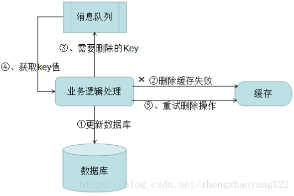
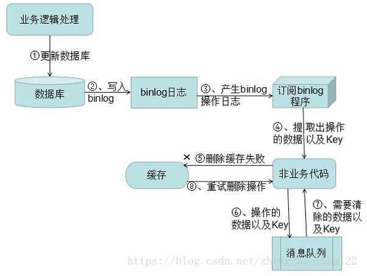
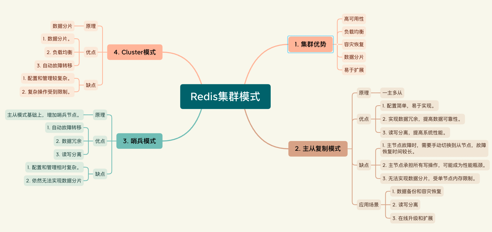
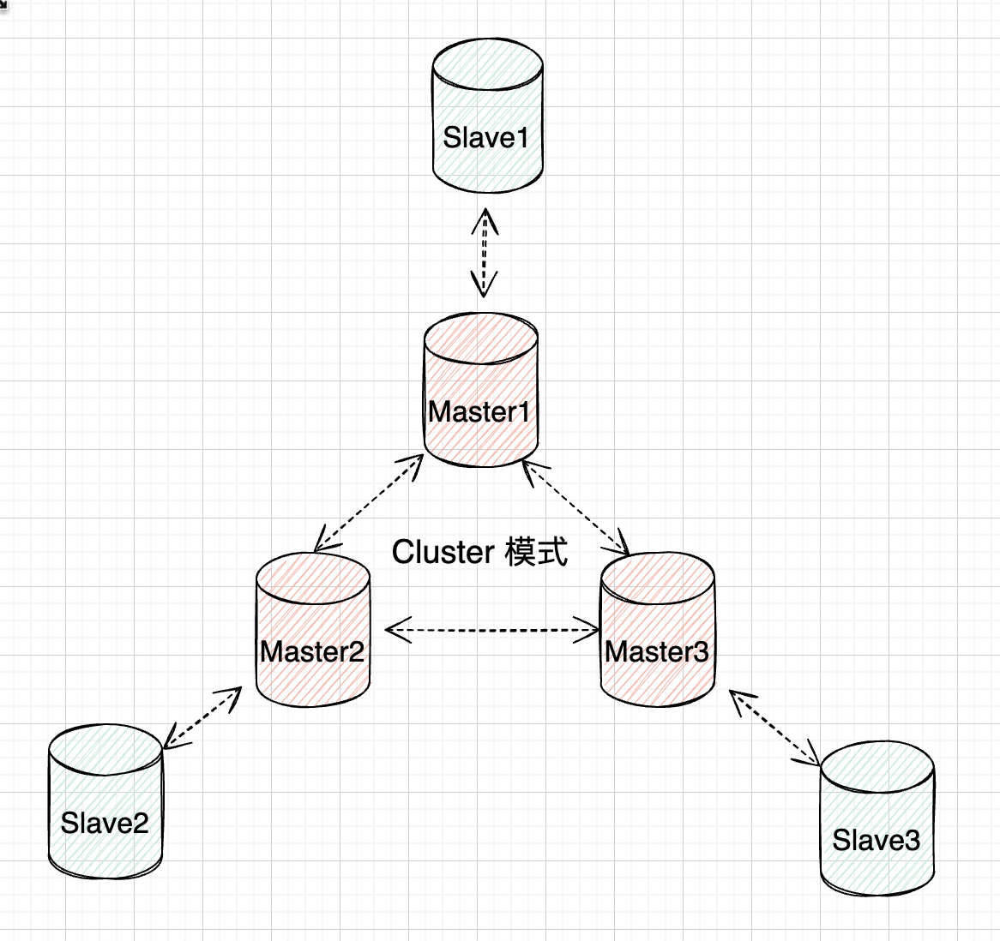

# Java总结-缓存

## 一、缓存和数据库双写不一致性问题

**【场景一】** 先操作缓存，再写数据库成功之前，如果有读请求发生，可能导致旧数据入缓存，引发数据不一致。在分布式环境下，数据的读
写都是并发的，一个服务多机器部署，对同一个数据进行读写，在数据库层面并不能保证完成顺序，就有可能后读的操作先完成
（读取到的是脏数据），如果不采用给缓存设置过期时间策略，该数据永远都是脏数据。

### 1、延迟双删（缓存-库-缓存）

**【解决办法】**：<br>

- 可采用更新前后双删除缓存策略；<br>
  > 参考链接：[延迟双删如此好用，为何大厂从来不用](https://mp.weixin.qq.com/s/CR7e6pjKd5cPdVnkq5mqbw)

```java
import java.util.concurrent.TimeUnit;

public class CacheService {

    // 缓存客户端，比如 Redis
    private CacheClient cacheClient;
    // 数据库服务接口
    private DatabaseService databaseService;

    public CacheService(CacheClient cacheClient, DatabaseService databaseService) {
        this.cacheClient = cacheClient;
        this.databaseService = databaseService;
    }

    public void updateDataWithCache(String key, String value) {
        // 1. 第一次删除缓存
        cacheClient.delete(key);

        // 2. 更新数据库
        databaseService.update(key, value);

        // 3. 延迟删除缓存
        new Thread(() -> {
            try {
                // 延迟一段时间（具体时间根据业务实际情况设定，通常是事务提交所需时间）
                TimeUnit.SECONDS.sleep(1);
                cacheClient.delete(key);
            } catch (InterruptedException e) {
                Thread.currentThread().interrupt();
                System.out.println("延迟双删任务被中断：" + e.getMessage());
            }
        }).start();
    }
}

```

- 可以通过“串行化”解决，保证同一个数据的读写落在同一个后端服务上:

    - 核心思路：

      通过<span style="color: red;">**哈希一致性或分布式锁，确保对同一个 key 的读写请求串行执行**</span>，从而避免并发冲突。

```java
import java.util.concurrent.locks.ReentrantLock;

public class CacheServiceWithSerialization {
    // 缓存客户端
    private CacheClient cacheClient;
    // 数据库服务接口
    private DatabaseService databaseService;
    // 本地锁示例
    private static final ReentrantLock lock = new ReentrantLock();

    public void updateDataWithSerialization(String key, String value) {
        // 获取分布式锁，确保同一时刻只有一个线程操作 key
        boolean lockAcquired = DistributedLock.tryLock(key, 5, TimeUnit.SECONDS);
        if (!lockAcquired) {
            System.out.println("未能获得锁，操作已被其他线程占用");
            return;
        }

        try {
            // 1. 写缓存
            cacheClient.set(key, value);

            // 2. 更新数据库
            databaseService.update(key, value);

            // 3. 删除缓存
            cacheClient.delete(key);

        } finally {
            DistributedLock.release(key); // 释放分布式锁
        }
    }
}

```

**【场景二】** 先操作数据库，再清除缓存。如果删缓存失败了，就会出现数据不一致问题。

### 2、先改库，后删缓存

**【方案一】** ：将删除失败的 key 值存入队列中重复删除，如下图：



（1）更新数据库数据。

（2）缓存因为种种问题删除失败。

（3）将需要删除的 key 发送至消息队列。

（4）自己消费消息，获得需要删除的 key。

（5）继续重试删除操作，直到成功。

::: warning
【缺点】：对业务线代码造成大量的侵入。于是有了方案二。
:::

**【方案二】**：通过订阅 binlog 获取需要重新删除的 Key 值数据。在应用程序中，另起一段程序，获得这个订阅程序传来的消息，进行删除缓存操作。



（1）更新数据库数据

（2）数据库会将操作信息写入 binlog 日志当中

（3）订阅程序提取出所需要的数据以及 key

（4）另起一段非业务代码，获得该信息

（5）尝试删除缓存操作，发现删除失败

（6）将这些信息发送至消息队列

（7）重新从消息队列中获得该数据，重试操作

## 二、Redis 内存用完会发生什么

Redis 是一个基于内存的数据库，所有数据都存储在内存中。当内存用完时，Redis 的行为取决于配置，可能包括：

- 默认情况下，新写入操作会失败，Redis 返回错误。

- 如果设置了 maxmemory 和 maxmemory-policy，Redis 会根据指定策略回收内存，比如淘汰最少使用的键（LRU 算法）或即将过期的键。

- **如果没有合理配置，内存压力可能导致操作系统触发 OOM（Out of Memory）机制，将 Redis 进程终止**。

## 三、Redis 过期策略？

Redis 支持为某些键（key）设置过期时间（TTL，Time To Live），当键的生存时间过期后，Redis 会自动删除该键。过期策略是 Redis
保证键值过期自动清除的机制。

Redis 提供了多种方式来设置键的过期时间：

- 使用 EXPIRE 命令设置键的过期时间。
- 使用 SET 命令的 EX（秒）和 PX（毫秒）参数来设置过期时间。
- 使用 PERSIST 命令来移除过期时间。

Redis 的过期策略包括：

**惰性删除**：当你访问某个键时，Redis 会检查该键是否已经过期，如果过期则删除它。换句话说，只有当你访问过期的键时，它才会被删除。

**定期删除**：为了避免惰性删除带来的性能问题，Redis 会周期性地检查一些键的过期时间，并删除那些已经过期的键。这个操作是通过定时任务（默认每
100 毫秒）进行的，检查一部分过期的键。

::: tip
但是实际上这还是有问题的，如果定期删除漏掉了很多过期 key，然后你也没及时去查，也就没走惰性删除，此时会怎么样？如果大量过期
key 堆积在内存里，导致 Redis 内存块耗尽了，咋整？

答案是：**走内存淘汰机制**。
:::

## 四、Redis 内存淘汰机制

### 1、常见的淘汰机制对比

| 策略名称            | 描述                                 |
|-----------------|------------------------------------|
| noeviction      | 默认策略，当内存不足时，不会淘汰任何数据，新写操作会失败，返回错误。 |
| allkeys-lru     | 从所有键中移除最近最少使用的键（基于 LRU）。           |
| volatile-lru    | 从设置了过期时间的键中移除最近最少使用的键（基于 LRU）。     |
| allkeys-random  | 从所有键中随机移除一个键。                      |
| volatile-random | 从设置了过期时间的键中随机移除一个键。                |
| volatile-ttl    | 从设置了过期时间的键中移除即将过期（TTL 最小）的键。       |
| allkeys-lfu     | 从所有键中移除最不常使用的键（基于 LFU）。            |
| volatile-lfu    | 从设置了过期时间的键中移除最不常使用的键（基于 LFU）。      |

### 2、手写一个 LRU 算法

## 五、缓存穿透、缓存击穿、缓存雪崩和缓存刷新

### 1、缓存穿透（Cache Penetration）：

缓存穿透是指查询一个数据，如果这个<span style="color: red;">**数据在缓存中不存在并且数据库中也不存在**</span>
，那么该请求会直接访问数据库。这种情况会导致每次请求都去查询数据库，从而绕过了缓存机制，影响系统的性能。

**发生原因**：

- 用户查询的数据在缓存和数据库中都没有，通常是由于缓存的空数据没有设置好（没有缓存失败的记录）或者数据库中并未存在数据。

**应对方案：**

- **缓存空对象**： 对于查询结果为空的数据，可以将空数据（例如，返回空的 JSON 或者一个特殊的标志值）也缓存一段时间，避免重复查询数据库。

- **布隆过滤器（Bloom Filter）**：通过布隆过滤器在查询缓存之前先过滤掉那些根本不存在的数据，避免无效查询直接到数据库。

- **全局查询校验**：使用应用层或 API 层的校验来保证访问的数据必须经过有效性验证。

### 2、缓存击穿（Cache Breakdown）：

缓存击穿是指<span style="color: red;">**某一时刻，大量的请求同时访问某个缓存失效的数据**</span>
（通常是在数据的缓存过期的瞬间），导致大量请求同时访问数据库，进而产生数据库的压力。

**发生原因**：

- 因为缓存过期时间统一，导致缓存过期的瞬间会有多个请求同时访问，造成缓存失效瞬间的流量激增，影响数据库性能。

**应对方案：**

- **设置合理的缓存过期时间**：使用不易过期或者过期时间设置得较为分散，避免同一时刻缓存大量失效。

- **加锁机制（缓存重建时锁）**：当缓存失效时，第一个请求会去数据库查询并更新缓存，其他请求等待缓存更新，避免同一时刻多个请求同时访问数据库。

- **互斥锁（Mutex Lock）或 Redis 分布式锁**：通过加锁机制，确保只有一个请求去数据库查询数据，缓存中的数据可以在请求期间重建。

### 3、缓存雪崩（Cache Avalanche）:

缓存雪崩是指<span style="color: red;">**在同一时刻大量缓存过期或失效，导致大量请求直接访问数据库**</span>
，最终造成数据库的压力过大，无法承载，系统可能出现崩溃。

**发生原因**：

- 缓存的过期时间过于集中，导致缓存同时过期。

- 配置不当的缓存策略或没有分布式缓存的协调，导致大量请求访问后端数据库。

**应对方案**：

- **避免缓存集中失效**：使用缓存的过期时间设置为随机值（例如，加上一些随机的时间范围），使得缓存过期时间不一致。

- **使用备用缓存（热点数据预热）**：对于重要数据，可以通过定时任务或者主动刷新策略提前预加载缓存，以避免数据库被打爆。

- **限流、降级机制**：使用熔断、限流、降级等策略，防止系统在数据库压力过大的时候还继续请求。

::: tip
对于 Redis 挂掉了，请求全部走数据库，也属于缓存雪崩，我们可以有以下思路进行解决：

**事发前**：实现 Redis 的高可用（主从架构+Sentinel 或者 Redis Cluster），尽可能避免 Redis 挂掉这种情况。

**事发中**：万一 Redis 真的挂了，我们可以设置本地缓存（ehcache）+ 限流（hystrix），尽量避免我们的数据库被干掉。

**事发后**：Redis 持久化，重启后自动从磁盘上加载数据，快速恢复缓存数据。
:::

### 4、缓存刷新（Cache Refresh）：

缓存刷新是指缓存中的数据保持实时性的问题，需要保证缓存和数据库中的数据一致性或定期更新缓存数据。

**发生原因**：

- 缓存的更新和数据库中的数据不一致，可能会导致读取的缓存数据是过时的。

**应对方案**：

- **主动更新缓存**：在对数据库数据进行写操作时，主动删除缓存或更新缓存中的相关数据，保持一致性。

- **设置合理的缓存过期时间**：定期失效缓存，以促使系统进行数据刷新。

- **双写策略（写缓存与写数据库）**：对于需要更新数据的操作，可以使用 "先更新缓存再更新数据库" 或者 "先更新数据库再更新缓存"
  等方式来确保缓存及时刷新。

- **定时刷新**：使用定时任务定期更新缓存数据，避免缓存内容过于陈旧。

## 六、Redis 的常用数据结构有哪些？

### 1. **String（字符串）**

- 最基本、最常用的数据结构，支持普通的 `set/get` 操作。

- Value 可以是字符串，也可以是数字，适合用来做简单的缓存和计数功能。

- 应用示例：

  - 缓存热点数据，如配置信息、Token、验证码等。
  
  - 实现简单的计数器，比如文章阅读量、点赞数、限流等。

### 2. **Hash（哈希表）**

- 以键值对（field-value）形式存储，适合存放对象类型的数据。

- 可以直接对某个字段进行单独读取或修改，非常灵活。

- 应用示例：

  - 存储用户信息（如：以 CookieId 或 UserId 作为 Key，存储用户登录状态等）。
  
  - 实现轻量级的 Session 机制，结合设置过期时间（如 30 分钟失效），模拟类似 Session 的效果。

### 3. **List（列表）**

- 一个链表结构，可以按照插入顺序排序，支持元素的插入、删除等操作。

- 可以从两端推入或弹出元素（支持队列和栈的应用）。

- 应用示例：

  - 实现简单的消息队列系统（如：生产者-消费者模型）。
  
  - 基于 `lrange` 命令实现分页查询，提升大数据量场景下的读取效率。


### 4. **Set（集合）**

- 无序集合，元素具有唯一性（去重特性）。

- 支持集合间的交集、并集、差集等操作。

- 应用示例：

  - 全局唯一性校验，比如防止用户重复签到、IP去重等。
  
  - 社交系统中，计算共同好友（交集）、所有好友（并集）、特有好友（差集）等。


### 5. **Sorted Set（有序集合）**

- 类似 Set，但是每个元素都会关联一个权重（Score），元素按 Score 从小到大自动排序。

- 既能去重，又能排序，功能更强大。

- 应用示例：

  - 实现排行榜系统，如游戏积分排行、文章热度排行，支持快速取出 Top N。

  - 构建延时队列，使用 Score 作为时间戳，按时间顺序处理任务。

**更多类型**： <RouteLink to="/cache/1_redis.md#redis数据结构">Redis数据结构</RouteLink>


## 七、本地缓存与分布式缓存

### 1、本地缓存（Local Cache，如 Caffeine）

**优势**：
- 无需网络通信，访问速度极快。
- 在高并发场景下能显著降低后端压力，提升系统性能。

**劣势**：
- 占用应用进程的堆内存，增加 GC 压力。
- 容量受限于单机资源，缓存内容无法在多实例间共享。

---

### 2、分布式缓存（Distributed Cache，如 Redis）

**优势**：
- 可横向扩展（通过集群方式），容量几乎无限。
- 多个系统/服务可以共享同一份缓存数据。

**劣势**：
- 存在网络延迟，访问速度相对本地缓存较慢。
- 数据需要序列化/反序列化，增加了额外开销。
- 需要独立部署和维护分布式缓存系统（如 Redis 集群）。

---

::: tip 使用建议
- **本地缓存** 适合：
  - 数据量较小
  - 访问频率高且可预见
  - 对延迟敏感的数据（例如热点数据）
  - 特别适合缓存**不变对象**

- **分布式缓存** 适合：
  - 数据量较大
  - 访问模式不可预测
  - 需要跨服务共享缓存的场景
:::


## 八、Redis 的线程模型

Todo

## 九、Redis 的并发竞争问题如何解决?

Todo

## 十、了解 Redis 的事务吗？

Todo

## 十一、Redis 的选举算法和流程是怎样的

Todo


## 十二、Redis 的持久化机制

Redis 提供了两种主要的持久化方式，用于在服务重启后恢复数据：

### 1、RDB（Redis DataBase Snapshot）

**定义**：
- 将当前内存中的数据**在某个时间点**保存为一个二进制快照文件（`dump.rdb`）。
- 是一种**周期性保存**的机制，不是实时写盘。

**特点**：
- 生成的文件紧凑，适合用于备份、灾难恢复。
- 恢复数据速度快，适合大规模数据的冷启动。
- 但是如果 Redis 异常宕机，最近一次保存之后的变更会**丢失**。

**使用场景**：
- 对数据完整性要求不极端（能接受少量数据丢失）。
- 适合做**冷备份**、**主从复制**时初始同步。
- 内存数据量大，需要快速恢复时。

### 2、AOF（Append Only File）

**定义**：
- 将所有对 Redis 的写操作（命令）以追加方式记录到日志文件（`appendonly.aof`）。
- 可以通过重新执行这些命令来恢复数据。

**特点**：
- 数据更安全，可配置成几乎**每次写操作都落盘**（`appendfsync always`）。
- 文件体积会随着时间增长，但可以通过 AOF 重写（rewrite）机制压缩。
- 恢复数据速度慢于 RDB（因为需要逐条 replay 命令）。

**使用场景**：
- 对数据一致性要求高（几乎不能丢数据）。
- 用于业务系统中**数据敏感场景**（如金融、电商订单系统等）。
- 需要实时持久化变化的缓存数据。

### 3、RDB vs AOF

| 项目         | RDB                          | AOF                          |
|:------------|:------------------------------|:-----------------------------|
| 持久化时机   | 周期性快照                    | 实时追加日志                  |
| 数据安全性   | 可能丢失最近一次保存后的数据     | 丢失极少（取决于 fsync 策略）   |
| 文件大小     | 通常较小                      | 通常较大，但可压缩             |
| 恢复速度     | 快                           | 相对慢，需要逐条命令重放         |
| 使用场景     | 备份、快速冷启动               | 数据一致性要求高的业务场景        |

---

::: tip 建议
- 如果对数据安全极度敏感 → 推荐使用 **AOF**。
- 如果追求恢复速度、且能接受部分数据丢失 → 推荐使用 **RDB**。
- **生产环境通常同时开启 RDB + AOF**，以兼顾性能与安全性。
:::

## 十三、什么是缓存预热？

新的缓存系统没有任何数据，在缓存重建数据的过程中，系统性能和数据负载都不太好，所以最好在系统上线之前就把缓存的热点数据加载到缓存中，这种缓存预加载手段就是缓存预热。

## 十四、什么是缓存热备？

缓存热备既当一个缓存服务器不可用时能实时切换到备用缓存服务器，不影响缓存使用。集群模式下，每个主节点都会有一个或多个从节点备用，一旦主节点挂掉，从节点会被哨兵提升为主节点使用。

## 十五、Redis 集群问题总结

### 1、Redis 集群分类



### 2、Redis 集群如何搭建？

#### 主从模式方案


- 部署实测：Todo

#### 哨兵模式方案：


-
部署实测：[三台 Centos7.9 中 Docker 部署 Redis 哨兵模式](https://blog.csdn.net/weixin_43108539/article/details/145148482)

#### 集群模式方案：



-
部署实测：[三台 Centos7.9 中 Docker 部署 Redis 集群模式](https://blog.csdn.net/weixin_43108539/article/details/145098017)

## 十六、Redis 集群同步数据

Todo

## 十七、Redis 的主从复制原理

Todo

## 十八、知道哪些 Redis 的优化操作

## 十九、怎么使用 Redis 实现消息队列？

## 二十、Redis 热 Key 问题如何解决?

热key问题是指某些键因高频访问导致Redis性能瓶颈或集群压力过高。

### 1、可预见的热Key处理

- 根据经验，提前预测

::: tip
这种方法在大多数情况下还是比较有效的。比较常见的就是电商系统中，会在秒杀、抢购等业务开始前就能预测出热key。
但是，这种方法局限性也很大，就是有些热key是完全没办法预测的，比如明星什么时候要官宣这种事情就无法预测。
:::

- 多级缓存处理

::: tip

:::

- 热key备份

::: tip

:::

- 热key拆分

::: tip

:::

原文链接：https://blog.csdn.net/weixin_45433817/article/details/130814075

### 2、不可预见的热Key处理

> 参考代码：[https://gitee.com/jd-platform-opensource/hotkey](https://gitee.com/jd-platform-opensource/hotkey)

## 二十一、Redis大 Key 问题如何解决?

## 二十二、Redis 6.x 为什么要引入多线程?

## 二十三、Redis 说说分布式锁？

- 点击查看  <RouteLink to="/cache/1_redis#redis分布式锁">分布式锁</RouteLink>
