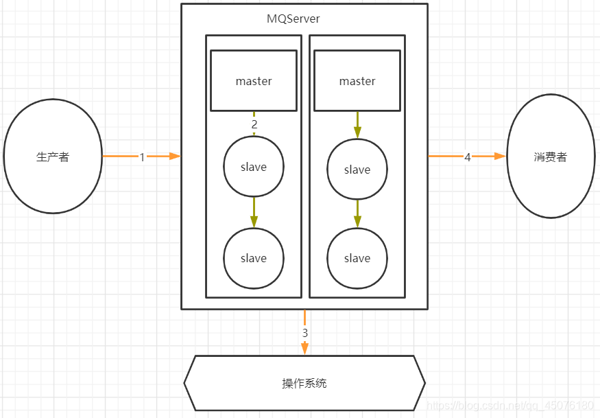

# Java总结-消息队列
## 一、消息队列的使用场景
以下介绍消息队列在实际应用常用的使用场景。异步处理、应用解耦、流量削锋、日志处理和消息通讯五个个场景：

- 1、异步处理

例如：用户注册后，需要发注册邮件和注册短信

- 2、应用解耦

例如：用户下单后，订单系统需要通知库存系统。

- 3、流量削锋

例如：秒杀或团抢活动中使用广泛。

秒杀活动，一般会因为流量过大，导致流量暴增，应用挂掉。一般需要在应用前端加入消息队列。

- 4、日志处理

比如 Kafka 的应用，解决大量日志传输的问题

- 5、消息通信

例如：消息队列一般都内置了高效的通信机制，因此也可以用纯消息通信。比如实现点对点消息队列，或者聊天室。

## 二、消息队列的工作流程？


【1】发送端 MQ-Product （消息生产者）将消息发送给 MQ-server；


【2】MQ-server 将消息落地，持久化到数据库等；


【3】MQ-server 回 ACK 给 MQ-Producer；


【4】MQ-server 将消息发送给消息接收端 MQ-Consumer （消息消费者）；


【5】MQ-Consumer 消费接收到消息后发送 ACK 给 MQ-server；


【6】MQ-server 将落地消息删除；

## 三、MQ如何保证消息不丢失？



1、生产者消息发送回调处理：

即为异步发送，处理callback的重试机制；

2、主从复制消息丢失处理
- 如 RocketMQ的消息的强同步复制（同步复制模式）或者异步复制
- 如 Kafka 默认提供 ISR（in-sync replica）机制，确保所有副本都同步更新数据

3、消息刷盘完后，响应producer：

4、消息消费完成后，响应消息 mq-server：

总结：但是针对于不紧要的数据，提高系统速度，可以接受消息丢失问题

## 四、Mq消息的幂等性（重复消费）如何保证？

开篇：所有Mq产品都没有主动提供消费者重复消费的问题，最好的方式是自己做一个全局的唯一标识

1、全局唯一标识ID：
```java
String messageId = message.getId();
if (idempotentRepository.exists(messageId)) {
    // 消息已处理，忽略
    return;
}
// 处理消息
processMessage(message);
// 标记消息为已处理
idempotentRepository.save(messageId);
```

2、使用去重存储（如 Redis、数据库） 保存已经处理的消息标识符

```java
if (redis.setIfAbsent(messageId, "processed", 1, TimeUnit.HOURS)) {
    processMessage(message);
} else {
    // 消息重复，忽略
}
```

3、幂等处理逻辑

```java
INSERT INTO orders (order_id, user_id, amount)
VALUES ('12345', 1, 100)
ON DUPLICATE KEY UPDATE updated_at = NOW();
```
4、MQ 自带机制

一些高级消息中间件（如 RocketMQ、Kafka）提供了重复消费控制的机制。

RocketMQ：

- 使用消息的 msgId 或 unique key 。
- 配合事务消息进行两阶段提交（prepare 和 confirm 阶段）。

Kafka：

- 消费组结合 offset 提交：
    - 通过消费者维护 offset，避免重复拉取消息。
    - 手动控制 offset 提交时机，仅在成功处理消息后更新。

## 五、Mq如何保证消息顺序消费？

### 1、单队列单消费者

将相关联的消息发送到同一条队列中。

设置单个消费者依次处理消息，确保消费顺序。
:::tip
优点：
实现简单，天然保持顺序性。
:::
:::warning
缺点：
队列吞吐量有限，性能受单消费者影响。
:::

### 2、按分区或分片管理
使用消息队列的分区机制（如 Kafka 的分区，RocketMQ 的队列）。

对某种业务键（如订单号、用户 ID 等）进行哈希计算，将同一键的消息路由到同一个分区。
消费者按分区逐条消费，保证分区内的消息顺序。

实现方式：

消息路由时分区： 生产者发送消息时，根据业务键计算分区：
```java
int partition = businessKey.hashCode() % numPartitions;
producer.send(new ProducerRecord<>("topic", partition, key, value));
```
分区消费时单线程： 消费者为每个分区分配单独的线程，按顺序拉取和处理消息。
:::tip
优点：
可以并行处理不同分区，性能更高。
分区内部顺序可保证。
:::
:::warning
缺点：
跨分区的全局顺序无法保证。
分区配置复杂度增加。
:::

:::danger
to be continue
:::

## 六、MQ如何保证消息的高效读写

todo

## 七、MQ如何保证分布式事务的最终一致性

todo

## 八、如何设计一个MQ？

todo

## 九、RocketMQ常见面试题：


以下内容待实践后调整：

> 参考资料：[RocketMQ常见面试题](https://blog.csdn.net/ctwctw/article/details/107463884)

## 十、Kafka常见面试题：

以下内容待实践后调整：

> 参考资料：[Kafka常见面试题](https://javabetter.cn/interview/kafka-40.html)

## 十一、RocketMQ与Kafka有何不同？

> [RocketMQ与Kafka有何不同(上)](https://mp.weixin.qq.com/s/P40GLfVa7oFq0c0JgolvIQ)
> 
> [RocketMQ与Kafka有何不同(下)](https://mp.weixin.qq.com/s/ioIr3nTBX5AMm3r8f49Mjw)