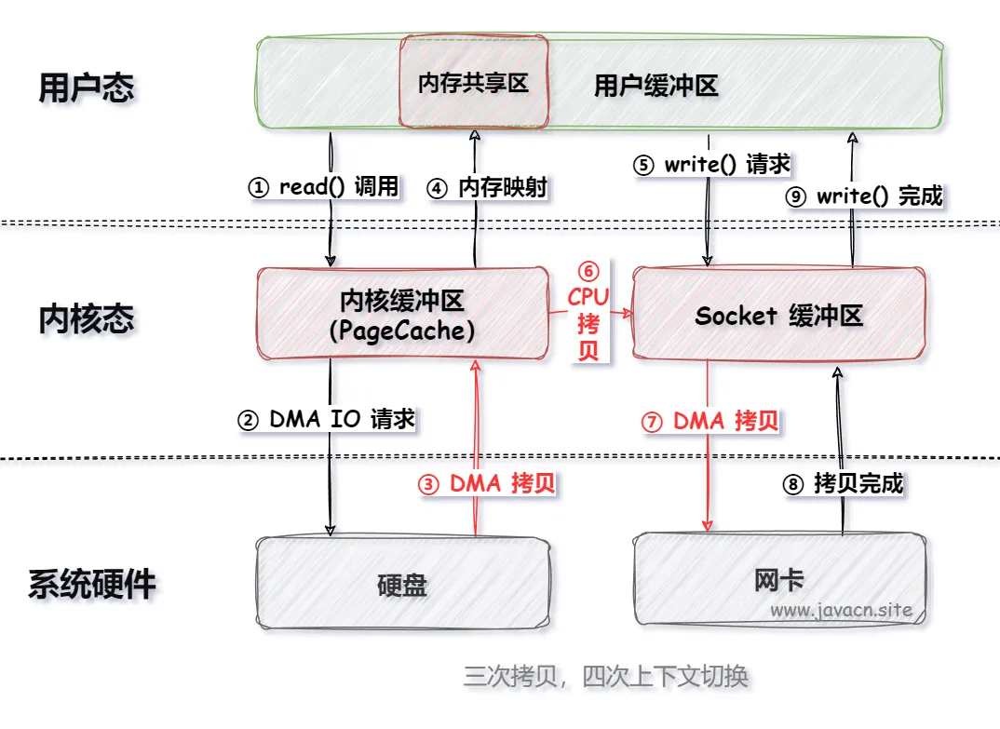
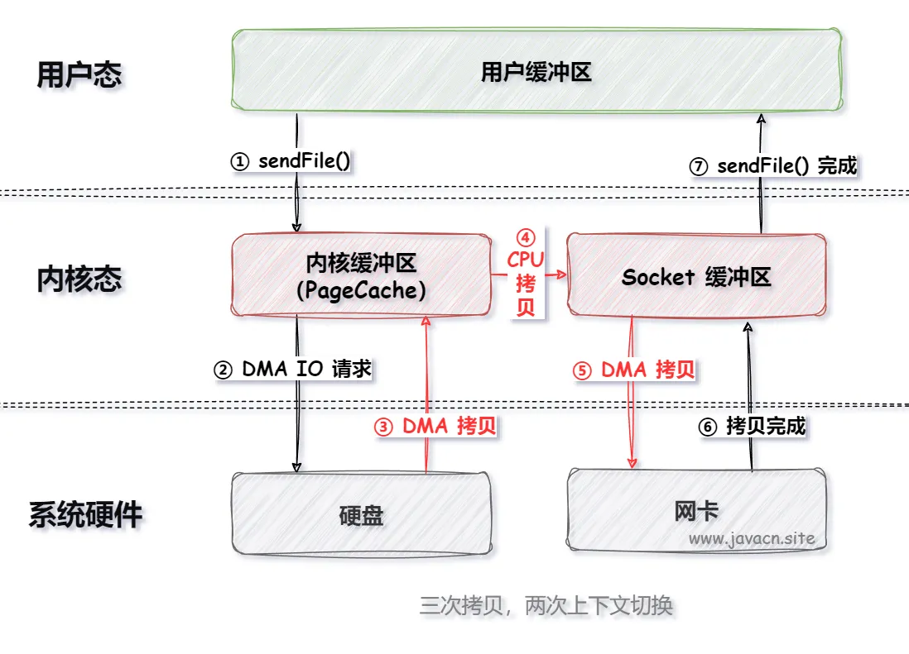
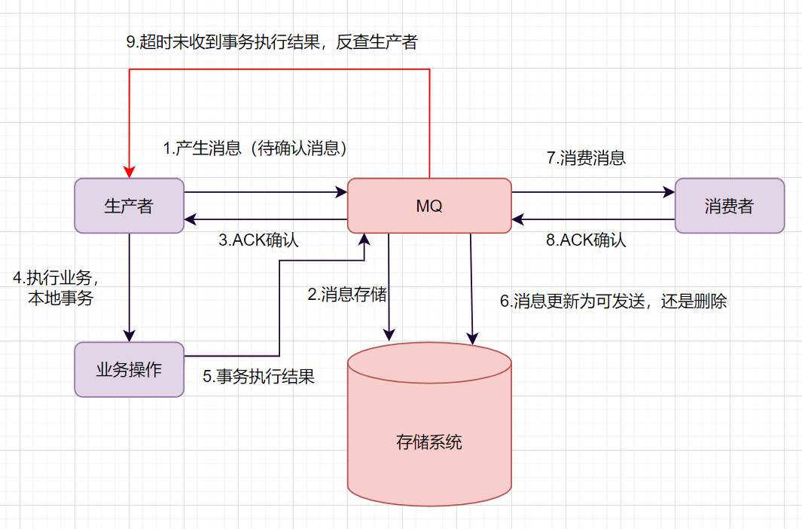
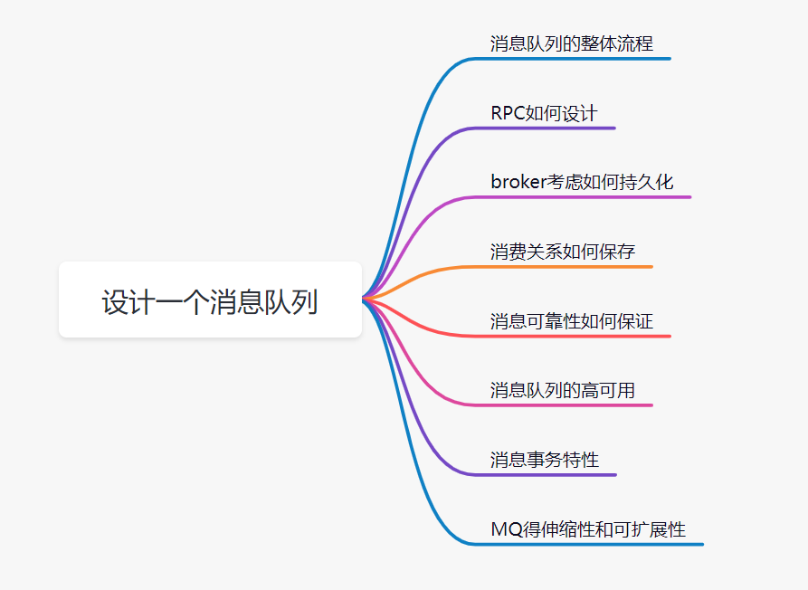
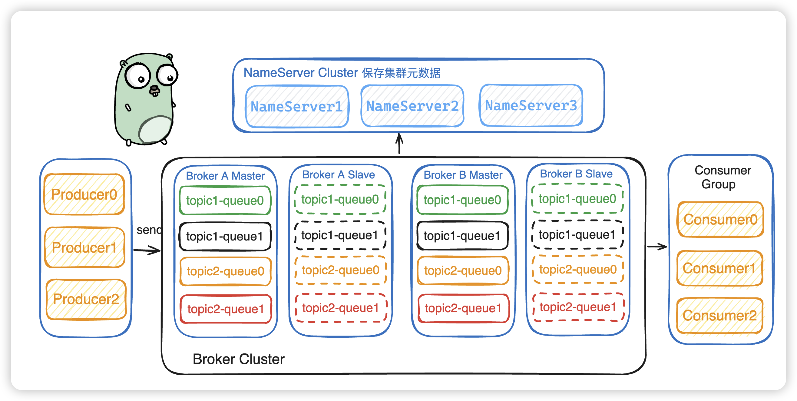
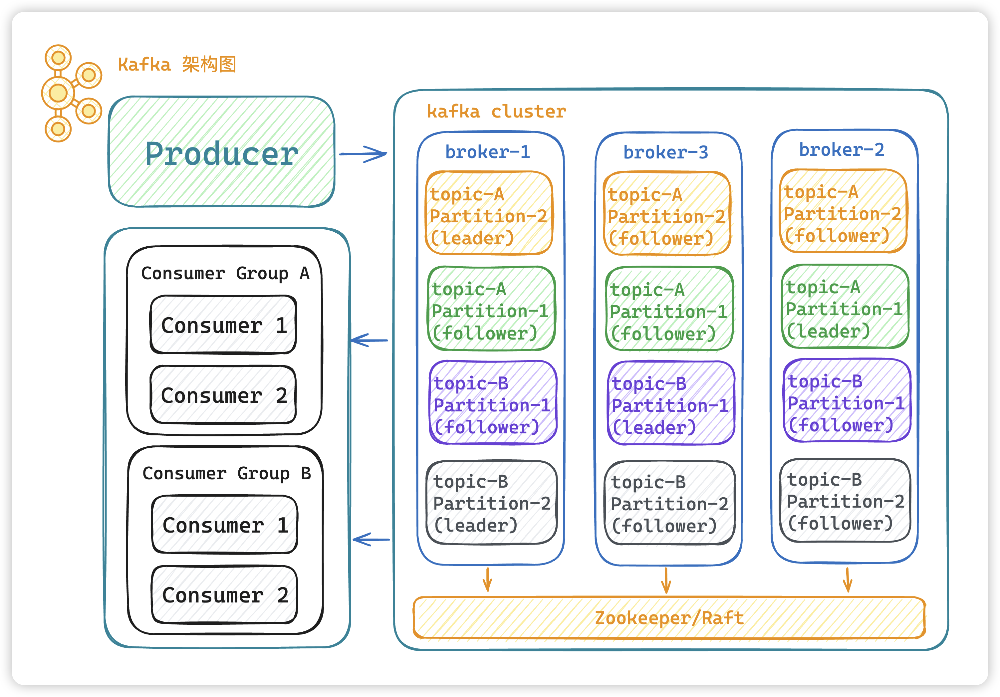

# Java总结-消息队列
## 一、消息队列的使用场景

更多详情见：<RouteLink to="/mq/1_mq#二、消息中间件的核心作用">消息队列-消息中间件的核心作用</RouteLink>

## 二、消息队列的工作流程？

以下是常见的消息队列的设计模型：


- 发送端 MQ-Product （消息生产者）将消息发送给 MQ-server；

- MQ-server 将消息落地，持久化到数据库等；

- MQ-server 回 ACK 给 MQ-Producer；

- MQ-server 将消息发送给消息接收端 MQ-Consumer （消息消费者）；

- MQ-Consumer 消费接收到消息后发送 ACK 给 MQ-server；

- MQ-server 将落地消息删除；

## 三、MQ如何保证消息不丢失？

一个消息从生产者产生，到被消费者消费，主要经过这4个过程：


因此如何保证MQ不丢失消息，可以从这四个阶段阐述：

### 1、生产者保证不丢失

生产端如何保证不丢消息呢？**确保生产的消息能到达存储端。**

如果是RocketMQ消息中间件，Producer生产者提供了三种发送消息的方式，分别是：

| 发送方式     | 说明                                        |
|----------|-------------------------------------------|
| **同步发送** | 生产者发送消息后，等待 Broker 确认，适用于对可靠性要求较高的场景。     |
| **异步发送** | 生产者发送消息后不等待 Broker 响应，而是通过回调函数处理结果，提高吞吐量。 |
| **单向发送** | 生产者只负责发送消息，不关心 Broker 是否收到，适用于日志收集等场景。    |

生产者要想发消息时保证消息不丢失，可以：

- 采用**同步方式**发送，send消息方法返回**成功**状态，就表示消息正常到达了存储端Broker。

- 如果send消息**异常**或者返回**非成功**状态，可以**重试**。

- 可以使用事务消息，RocketMQ的事务消息机制就是为了保证零丢失来设计的

### 2、主从复制不丢失

- 如 RocketMQ的消息的**强同步复制**（同步复制模式）或者异步复制

- 如 Kafka 默认提供 **ISR**（in-sync replica）机制，确保所有副本都同步更新数据

### 3、消息刷盘不丢失

消息刷盘完后，响应producer

如何保证存储端的消息不丢失呢？确保消息**持久化到磁盘**。大家很容易想到就是**刷盘机制**。

刷盘机制分**同步刷盘**和**异步刷盘**：

- 生产者消息发过来时，只有持久化到磁盘，RocketMQ的存储端Broker才返回一个成功的ACK响应，这就是**同步刷盘**。它保证消息不丢失，但是影响了性能。

- **异步刷盘**的话，只要消息写入PageCache缓存，就返回一个成功的ACK响应。这样提高了MQ的性能，但是**如果这时候机器断电了，就会丢失消息**。

::: tip
Broker一般是集群部署的，有master主节点和slave从节点。
- 消息到Broker存储端，只有主节点和从节点都写入成功，才反馈成功的ack给生产者。 这就是**同步复制**，它保证了消息不丢失，但是降低了系统的吞吐量。
- 与之对应的就是**异步复制**，只要消息写入主节点成功，就返回成功的ack，它速度快，但是会有**数据丢失**问题。
:::

### 4、消息阶段不丢失

消费者执行完业务逻辑，再反馈会Broker说消费成功，这样才可以保证消费阶段不丢消息。

### 5、例外可接受丢失

但是针对于不紧要的数据，提高系统速度，可以接受消息丢失问题

## 四、Mq消息的幂等性（重复消费）如何保证？

开篇：所有Mq产品都没有主动提供消费者重复消费的问题，最好的方式是自己做一个全局的唯一标识

### 1、全局唯一标识
```java
String messageId = message.getId();
if (idempotentRepository.exists(messageId)) {
    // 消息已处理，忽略
    return;
}
// 处理消息
processMessage(message);
// 标记消息为已处理
idempotentRepository.save(messageId);
```

### 2、使用去重存储

如 Redis、数据库等，保存已经处理的消息标识符

```java
if (redis.setIfAbsent(messageId, "processed", 1, TimeUnit.HOURS)) {
    processMessage(message);
} else {
    // 消息重复，忽略
}
```

### 3、幂等处理逻辑

```java
INSERT INTO orders (order_id, user_id, amount)
VALUES ('12345', 1, 100)
ON DUPLICATE KEY UPDATE updated_at = NOW();
```
### 4、MQ 自带机制

一些高级消息中间件（如 RocketMQ、Kafka）提供了重复消费控制的机制。

**RocketMQ：唯一标识及其事务**

- 使用消息的 msgId 或 unique key 。
- 配合事务消息进行两阶段提交（prepare 和 confirm 阶段）。

**Kafka： 消费组结合 offset 提交**

- 通过消费者维护 offset，避免重复拉取消息。
- 手动控制 offset 提交时机，仅在成功处理消息后更新。

## 五、Mq如何保证消息顺序消费？

### 1、单队列单消费者

- 生产者：将相关联的消息发送到同一条队列中。

- 消费者：设置单个消费者依次处理消息，确保消费顺序。
:::tip
优点：
实现简单，天然保持顺序性。
:::
:::warning
缺点：
队列吞吐量有限，性能受单消费者影响。
:::
例如,RocketMQ提供了如下方案：
```java
//顺序消息发送。
MessageBuilder messageBuilder = new MessageBuilderImpl();;
Message message = messageBuilder.setTopic("topic")
        //设置消息索引键，可根据关键字精确查找某条消息。
        .setKeys("messageKey")
        //设置消息Tag，用于消费端根据指定Tag过滤消息。
        .setTag("messageTag")
        //设置顺序消息的排序分组，该分组尽量保持离散，避免热点排序分组。
        .setMessageGroup("fifoGroup001")
        //消息体。
        .setBody("messageBody".getBytes())
        .build();
try {
    //发送消息，需要关注发送结果，并捕获失败等异常
    SendReceipt sendReceipt = producer.send(message);
    System.out.println(sendReceipt.getMessageId());
} catch (ClientException e) {
    e.printStackTrace();
}
//消费顺序消息时，需要确保当前消费者分组是顺序投递模式，否则仍然按并发乱序投递。
//消费示例一：使用PushConsumer消费顺序消息，只需要在消费监听器处理即可。
MessageListener messageListener = new MessageListener() {
    @Override
    public ConsumeResult consume(MessageView messageView) {
        System.out.println(messageView);
        //根据消费结果返回状态。
        return ConsumeResult.SUCCESS;
    }
};
//消费示例二：使用SimpleConsumer消费顺序消息，主动获取消息进行消费处理并提交消费结果。
//需要注意的是，同一个MessageGroup的消息，如果前序消息没有消费完成，再次调用Receive是获取不到后续消息的。
List<MessageView> messageViewList = null;
try {
    messageViewList = simpleConsumer.receive(10, Duration.ofSeconds(30));
    messageViewList.forEach(messageView -> {
        System.out.println(messageView);
        //消费处理完成后，需要主动调用ACK提交消费结果。
        try {
            simpleConsumer.ack(messageView);
        } catch (ClientException e) {
            e.printStackTrace();
        }
    });
} catch (ClientException e) {
    //如果遇到系统流控等原因造成拉取失败，需要重新发起获取消息请求。
    e.printStackTrace();
}
```

### 2、按分区或分片管理
使用消息队列的分区机制（如 Kafka 的分区，RocketMQ 的队列）。

对某种业务键（如订单号、用户 ID 等）进行哈希计算，将同一键的消息路由到同一个分区。
消费者按分区逐条消费，保证分区内的消息顺序。

- 发送消息时路由分区： 生产者发送消息时，根据业务键计算分区：
```java
int partition = businessKey.hashCode() % numPartitions;
producer.send(new ProducerRecord<>("topic", partition, key, value));
```
分区消费处理方案： 
- 单线程，消费者为每个分区分配单独的线程，按顺序拉取和处理消息。
- 使用分布式锁，实现按顺序拉取和处理消息。
:::tip
优点：
可以并行处理不同分区，性能更高。
分区内部顺序可保证。
:::
:::warning
缺点：
跨分区的全局顺序无法保证。
分区配置复杂度增加。
:::

### 3、手动定制消息顺序

如果在RabbitMQ或者Kafka中，就需要自行设计顺序消费逻辑；

## 六、MQ如何保证消息的高效读写？

### 1、零拷贝（Zero Copy）

#### 1.1、MMap

MMap（Memory Map）是 Linux 操作系统中提供的一种将文件映射到进程地址空间的一种机制，通过 MMap 进程可以像访问内存一样访问文件，而无需显式的复制操作。

使用 MMap 可以把 IO 执行流程优化成以下执行步骤：



传统的 IO 需要四次拷贝和四次上下文（用户态和内核态）切换，而 MMap 只需要三次拷贝和四次上下文切换，从而能够提升程序整体的执行效率，并且节省了程序的内存空间。

#### 1.2、SendFile

在 Linux 操作系统中 sendFile() 是一个系统调用函数，用于高效地将文件数据从内核空间直接传输到网络套接字（Socket）上，从而实现零拷贝技术。
这个函数的主要目的是减少 CPU 上下文切换以及内存复制操作，提高文件传输性能。

使用 sendFile() 可以把 IO 执行流程优化成以下执行步骤：



### 2、顺序写入（Sequential Write）

- **磁盘顺序写入比随机写入快**（尤其是传统机械硬盘）。

- 举例说明：

  - Kafka 采用 **日志分段（Segment）+ 顺序** 写入，避免磁盘寻址开销，提高写入速度。

  - RocketMQ 采用 **CommitLog** 顺序写入，然后异步刷盘或同步复制到从节点。

### 3、PageCache机制

- **消息先写入 OS 的 PageCache（内存映射文件），再异步刷盘**，提升写入吞吐量。

- **Kafka、RocketMQ 都利用了操作系统的 PageCache** 来减少磁盘 IO。

### 4、其他方案

熟悉后写入，未完待续。。。


## 七、MQ如何保证分布式事务的最终一致性？

### 1、MQ基础流程

一条普通的MQ消息，从产生到被消费，大概流程如下：


- 生产者产生消息，发送带MQ服务器

- MQ收到消息后，将消息持久化到存储系统。

- MQ服务器返回ACk到生产者。

- MQ服务器把消息push给消费者

- 消费者消费完消息，响应ACK

- MQ服务器收到ACK，认为消息消费成功，即在存储中删除消息。

### 2、MQ事务消息

我们**举个下订单的例子**吧。订单系统创建完订单后，再发送消息给下游系统。如果订单创建成功，然后消息没有成功发送出去，下游系统就无法感知这个事情，出导致数据不一致。

如何保证数据一致性呢？可以使用**事务消息**。一起来看下事务消息是如何实现的吧。



- 生产者产生消息，发送一条**半事务消息**到MQ服务器

- MQ收到消息后，将消息持久化到存储系统，这条消息的状态是**待发送**状态。

- MQ服务器**返回ACK确认到生产者**，此时MQ不会触发消息推送事件

- 生产者执行本地事务，根据事务的执行情况进行后续判断

- 如果本地事务执行成功，即commit执行结果到MQ服务器；如果执行失败，发送rollback。

- 如果是正常的commit，MQ服务器更新消息状态为可发送；如果是rollback，即删除消息。

- 如果消息状态更新为**可发送**，则MQ服务器会push消息给消费者。消费者消费完就回ACK。

- 如果MQ服务器长时间没有收到生产者的commit或者rollback，它会反查生产者，然后根据查询到的结果执行最终状态。

## 八、MQ如何做到高可用？

消息中间件如何保证高可用呢？单机是没有高可用可言的，高可用都是对集群来说的，一起看下具体的高可用吧。
### 1、RocketMq高可用

### 2、Kafka高可用

Kafka 的基础集群架构，由多个broker组成，每个broker都是一个节点。当你创建一个topic时，它可以划分为多个partition，
而每个partition放一部分数据，分别存在于不同的 broker 上。也就是说，一个 topic 的数据，是分散放在多个机器上的，每个机器就放一部分数据。

有些伙伴可能有疑问，每个partition放一部分数据，如果对应的broker挂了，那这部分数据是不是就丢失了？那还谈什么高可用呢？

::: tip
Kafka 0.8 之后，提供了复制品副本机制来保证高可用，即每个 partition 的数据都会同步到其它机器上，形成多个副本。
然后所有的副本会选举一个 leader 出来，让leader去跟生产和消费者打交道，其他副本都是follower。写数据时，leader 
负责把数据同步给所有的follower，读消息时， 直接读 leader 上的数据即可。如何保证高可用的？就是假设某个 broker 宕机，
这个broker上的partition 在其他机器上都有副本的。如果挂的是leader的broker呢？其他follower会重新选一个leader出来。
:::

## 九、如何设计一个MQ？

这个问题面试官主要考察三个方面的知识点：

- 你有没有对消息队列的架构原理比较了解
- 考察你的个人设计能力
- 考察编程思想，如什么高可用、可扩展性、幂等等等。

遇到这种设计题，大部分人会很蒙圈，因为平时没有思考过类似的问题。大多数人平时埋头增删改啥，不去思考框架背后的一些原理。
有很多类似的问题，比如让你来设计一个 Dubbo 框架，或者让你来设计一个MyBatis 框架，你会怎么思考呢？

回答这类问题，并不要求你研究过那技术的源码，你知道那个技术框架的基本结构、工作原理即可。设计一个消息队列，我们可以从这几个角度去思考：



- 首先是消息队列的整体流程，producer发送消息给broker，broker存储好，broker再发送给consumer消费，consumer回复消费确认等。

- producer发送消息给broker，broker发消息给consumer消费，那就需要两次RPC了，RPC如何设计呢？可以参考开源框架Dubbo，你可以说说服务发现、序列化协议等等

- broker考虑如何持久化呢，是放文件系统还是数据库呢，会不会消息堆积呢，消息堆积如何处理呢。

- 消费关系如何保存呢？点对点还是广播方式呢？广播关系又是如何维护呢？zk还是config server

- 消息可靠性如何保证呢？如果消息重复了，如何幂等处理呢？

- 消息队列的高可用如何设计呢？可以参考Kafka的高可用保障机制。多副本 -> leader & follower -> broker 挂了重新选举 leader 即可对外服务。

- 消息事务特性，与本地业务同个事务，本地消息落库;消息投递到服务端，本地才删除；定时任务扫描本地消息库，补偿发送。

- MQ得伸缩性和可扩展性，如果消息积压或者资源不够时，如何支持快速扩容，提高吞吐？可以参照一下 Kafka 的设计理念，broker -> topic -> partition，
每个 partition 放一个机器，就存一部分数据。如果现在资源不够了，简单啊，给 topic 增加 partition，然后做数据迁移，增加机器，不就可以存放更多数据，提供更高的吞吐量了？

## 十、RocketMQ常见面试题


以下内容待实践后调整：

> 参考资料：[RocketMQ常见面试题](https://blog.csdn.net/ctwctw/article/details/107463884)

## 十一、Kafka常见面试题

以下内容待实践后调整：

> 参考资料：[Kafka常见面试题](https://javabetter.cn/interview/kafka-40.html)

## 十二、RocketMQ与Kafka对比？

### 1、RocketMQ架构图

> 参考地址：[https://blog.csdn.net/weixin_45304503/article/details/140248110](https://blog.csdn.net/weixin_45304503/article/details/140248110)



### 2、Kafka架构图

> 参考地址：[https://blog.csdn.net/weixin_45304503/article/details/140088911](https://blog.csdn.net/weixin_45304503/article/details/140088911)




> RocketMQ与Kafka有何不同(上): [https://mp.weixin.qq.com/s/P40GLfVa7oFq0c0JgolvIQ](https://mp.weixin.qq.com/s/P40GLfVa7oFq0c0JgolvIQ)

> RocketMQ与Kafka有何不同(下): [https://mp.weixin.qq.com/s/ioIr3nTBX5AMm3r8f49Mjw](https://mp.weixin.qq.com/s/ioIr3nTBX5AMm3r8f49Mjw)
