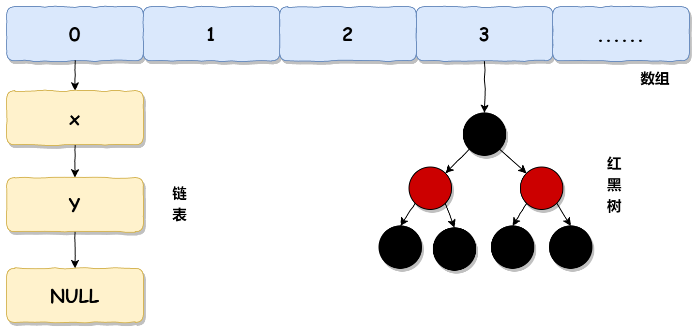
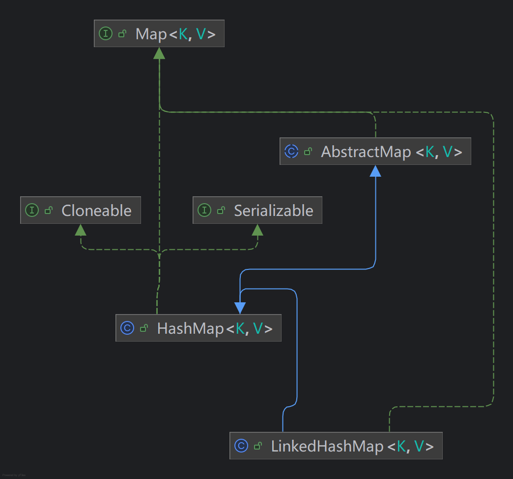
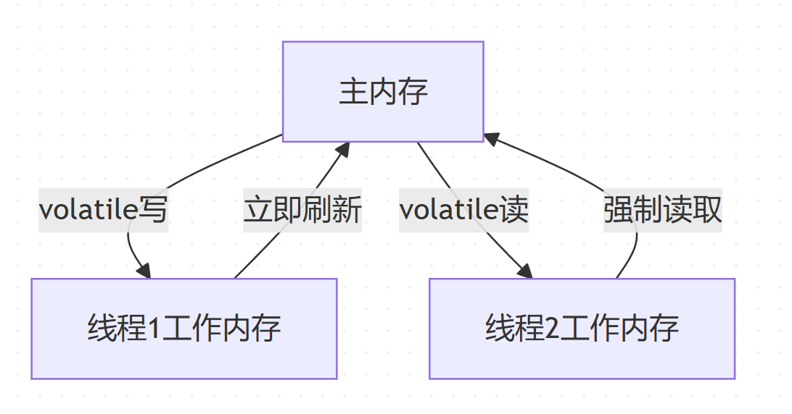
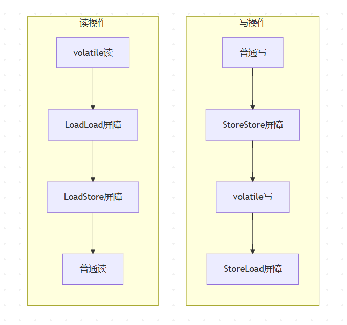
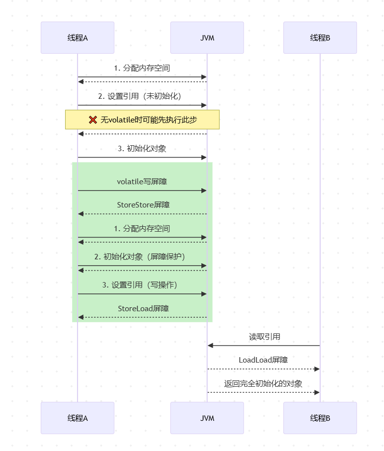

# Java 基础

- API地址：[https://docs.oracle.com/en/java/javase/](https://docs.oracle.com/en/java/javase/)
- 源码地址：[https://github.com/openjdk](https://github.com/openjdk)

## 一、Hashmap分析

HashMap 是一种基于哈希表的数据结构，它实现了 Map 接口，用于存储键值对 (key-value)。其基本原理如下：

### 1、哈希表（Hash Table）

HashMap 是基于哈希表实现的，哈希表的基本思想是通过将数据的键值对映射到一个数组的索引位置上来提高数据查找的效率。具体流程如下：

- **哈希函数**： HashMap 使用哈希函数将键（key）映射到数组的索引位置。哈希函数的目的是通过计算一个值，将不同的键映射到哈希表中的位置。

- **数组**： 哈希表内部使用一个数组来存储数据。数组中的每个元素存储一个链表（或者在 Java 8 后是
  <RouteLink to="/algorithm/0_base_4_tree#红黑树-balanced-binary-search-tree-bbst">红黑树</RouteLink>），用于处理哈希冲突。

### 2、哈希冲突

由于哈希函数不可能做到完全唯一的映射，不同的键可能会被映射到相同的索引，这种情况称为哈希冲突。HashMap 通过以下方式解决哈希冲突：

- **链表法（链式哈希）**： 在发生冲突的情况下，HashMap 会将冲突的键值对存储到一个链表中
  （或者 <RouteLink to="/algorithm/0_base_4_tree#红黑树-balanced-binary-search-tree-bbst">红黑树</RouteLink>）。
  当多个元素映射到同一个索引位置时，它们会形成一个链表。

- **<RouteLink to="/algorithm/0_base_4_tree#红黑树-balanced-binary-search-tree-bbst">红黑树</RouteLink> 法**： 在 Java 8
  及以后的版本中，如果链表的长度超过一定阈值（默认为 8），HashMap
  会将链表转化为 <RouteLink to="/algorithm/0_base_4_tree#红黑树-balanced-binary-search-tree-bbst">红黑树</RouteLink>，
  以提高查询效率。



### 3、扩容机制

当 HashMap 中的元素过多时，哈希表的负载因子（load factor）可能会达到阈值，导致哈希表的存储效率降低。默认情况下，负载因子为
0.75。
**当元素个数超过 (当前容量 * 负载因子) 时，HashMap 会进行扩容（通常是原数组大小的 2 倍）**。

扩容过程中，所有元素的哈希值会被重新计算，并重新放置到新的数组位置。这是因为 **哈希表的大小发生变化，导致原先的索引位置不再适用
**。

### 4、时间复杂度

- **查找、插入、删除 时间复杂度**：

在理想情况下，哈希表的查找、插入和删除操作的时间复杂度为 O(1)。但是，如果发生哈希冲突，性能会退化到 O(n)（链表长度为 n 时）。
使用 <RouteLink to="/algorithm/0_base_4_tree#红黑树-balanced-binary-search-tree-bbst">红黑树</RouteLink>优化后，最坏情况下时间复杂度为
O(log n)。

- **扩容操作的时间复杂度**：

扩容是一个相对耗时的操作，时间复杂度为 O(n)，但扩容操作是按需进行的，不是频繁发生，因此平均而言，HashMap 的操作仍然是 O(1)。

## 二、LinkedHashMap分析

### 1、有序性支持

与 `HashMap` 不同，`LinkedHashMap` 保留了元素的顺序特性：

- 默认按照 **插入顺序** 排列。
- 可以选择按照 **访问顺序** 排列（构造函数中设置 `accessOrder=true`）。

### 2、遍历顺序可控

使用 `Iterator` 遍历时，元素的顺序：

- 插入顺序模式下：与插入顺序一致；
- 访问顺序模式下：最近被访问的元素会排在后面。

### 3、应用场景：LRU 缓存

通过设置为访问顺序 + 搭配 `removeEldestEntry` 方法，`LinkedHashMap` 可轻松实现：

* **最近最少使用（LRU）缓存淘汰策略**

```java
new LinkedHashMap<>(16,0.75f,true) // accessOrder = true
```

### 4、类关系图



## 三、ConcurrentHashMap分析

### 1、基本特性

| **特性**	             | **描述**                                                                                      |
|---------------------|---------------------------------------------------------------------------------------------|
| **线程安全**            | 	采用 CAS + 自旋锁 替代 synchronized，减少锁竞争                                                         |
| **高并发**	            | 读操作无锁，写操作局部加锁，避免全局锁的性能瓶颈                                                                    |
| **不支持 null**        | 	key 和 value 都 不能为 null，防止 NullPointerException                                             |
| **比 Hashtable 性能高** | 	Hashtable 使用 synchronized 进行全表加锁，而 ConcurrentHashMap 采用 分段锁机制（JDK 1.7）和 CAS + 自旋锁（JDK 1.8） |

### 2、JDK 1.7 和 1.8 的区别

| **版本**	    | **JDK 1.7**	                   | **JDK 1.8 及以后**              |
|------------|--------------------------------|------------------------------|
| **底层数据结构** | 	Segment（分段锁） + 数组 + 链表        | 	数组 + 链表 + 红黑树（大于 8 个元素）     |
| **加锁方式**	  | 分段锁（Segment 继承 ReentrantLock）	 | CAS + 自旋锁 + synchronized（局部） |
| **并发控制**	  | 多个 Segment 互不影响                | 	CAS 方式优化，减少锁竞争              |
| **写入性能**	  | 分段锁，性能较好                       | 	CAS + 局部锁，性能更高              |
| **扩容机制**	  | Segment 级别扩容	                  | 无锁扩容，支持并发扩容                  |

::: warning Todo
更加精通后完成。。。
:::

## 四、ConcurrentHashMap 为何放弃分段锁？

### 1、JDK 1.7 前分段锁的弊端

在 JDK 1.7 之前，`ConcurrentHashMap` 使用 **分段锁（Segment）**，每个 `Segment` 管理独立的 `HashEntry[]`。但存在以下问题：

- **扩容性能差**：扩容时需要对整个 `Segment` 加锁，影响并发。

- **内存浪费**：预先分配多个 `Segment`，即使不使用也占用内存。

- **代码复杂**：锁管理复杂，且 `put()` 需要两次 `hash` 计算，降低性能。

### 2、JDK 1.8 后的新方案

JDK 1.8 放弃了 `Segment`，改用 **数组 + 链表 + 红黑树** 结构，结合 **CAS** 和 **synchronized** 局部加锁，提升并发性能。

- **CAS 无锁优化**：避免锁竞争，提高吞吐量。

```java
public V put(K key, V value) {
    // 扰动哈希，减少碰撞
    int hash = spread(key.hashCode());
    // 计算桶索引
    int i = (table.length - 1) & hash;

    // 如果桶是空的，直接 CAS 插入（无锁）
    if (tabAt(table, i) == null) {
        if (casTabAt(table, i, null, new Node<>(hash, key, value, null))) {
            return null;
        }
    }

    // 否则进入加锁流程
    synchronized (table[i]) {
        // 链表插入或树形插入逻辑...
    }
    return null;
}

```

- **synchronized 局部加锁**：只锁定当前桶位，减少锁竞争。

```java
private void putVal(int hash, K key, V value) {
    int i = (n - 1) & hash;
    Node<K, V> f = tabAt(table, i);

    if (f == null) {
        if (casTabAt(table, i, null, new Node<>(hash, key, value, null))) {
            return;
        }
    } else {
        synchronized (f) { // 局部加锁，只锁定当前桶位
            Node<K, V> e = f;
            while (e != null) {
                if (e.hash == hash && Objects.equals(e.key, key)) {
                    e.value = value; // 覆盖已有 key 的值
                    return;
                }
                e = e.next;
            }
            // 插入新节点
            f.next = new Node<>(hash, key, value, null);
        }
    }
}

```

- **红黑树优化**：当链表长度超过 8，转为红黑树，查询效率提高。

```java
private void putVal(int hash, K key, V value) {
    int i = (n - 1) & hash;
    Node<K, V> f = tabAt(table, i);

    if (f != null) {
        int binCount = 1;
        Node<K, V> e = f;
        while (e.next != null) {
            binCount++;
            e = e.next;
        }

        if (binCount >= TREEIFY_THRESHOLD) { // 默认值为8
            treeifyBin(table, i); // 转为红黑树结构
        }
    }
}

```

- **无锁扩容**：多个线程并行迁移数据，提升扩容效率。

```java
private void resize() {
    Node<K, V>[] oldTab = table;
    int oldCap = oldTab.length;
    int newCap = oldCap << 1;
    Node<K, V>[] newTab = new Node[newCap];

    for (int i = 0; i < oldCap; ++i) {
        Node<K, V> e = oldTab[i];
        if (e != null) {
            transferNode(e, newTab); // 将链表或树迁移到新表
        }
    }

    table = newTab;
}

```

### 3、两句话总结

- JDK 1.7 分段锁的性能差、空间浪费和复杂性问题。

- JDK 1.8 改用 CAS、synchronized 和红黑树，提升了并发性能和查询效率，支持无锁扩容。

> **提示**：JDK 1.8 的 `ConcurrentHashMap` 在高并发下表现更优，避免了分段锁带来的性能瓶颈。

## 四、HashMap、LinkedHashMap、ConcurrentHashMap对比

| **对比项**             | **HashMap**      | **LinkedHashMap** | **ConcurrentHashMap** |
|---------------------|------------------|-------------------|-----------------------|
| **底层数据结构**          | 哈希表（数组 + 链表/红黑树） | 哈希表 + 双向链表        | 哈希表（分段锁、CAS 机制）       |
| **key 是否有序**        | ❌ 无序             | ✅ 按插入顺序排序         | ❌ 无序                  |
| **时间复杂度**           | O(1) 平均，O(n) 最坏  | O(1) 平均，O(n) 最坏   | O(1) 平均，O(n) 最坏       |
| **是否允许 null key**   | ✅ 允许             | ✅ 允许              | ❌ 不允许                 |
| **是否允许 null value** | ✅ 允许             | ✅ 允许              | ❌ 不允许                 |
| **线程安全**            | ❌ 非线程安全          | ❌ 非线程安全           | ✅ 线程安全                |
| **适用场景**            | 快速查找、无序存储、大量数据   | 需要按插入顺序遍历的场景      | 并发环境下的高效哈希映射          |
| **主要应用**            | 缓存、映射查找、对象存储     | LRU 缓存、访问顺序存储     | 高并发场景，如缓存、线程池         |

## 三、TreeMap分析

### 1、源码分析

- 类关联图如下所示：


- TreeMap 的核心特点

| 特性              | 	说明                                                                                                                              |
|-----------------|----------------------------------------------------------------------------------------------------------------------------------|
| 底层实现            | 	 <RouteLink to="/algorithm/0_base_4_tree#红黑树-balanced-binary-search-tree-bbst">红黑树</RouteLink>（Red-Black Tree），是一种自平衡二叉搜索树（BST） |
| 排序方式            | 	默认按 key 的 自然顺序（Comparable） 排序，也可以传入 自定义 Comparator                                                                              |
| 时间复杂度           | 	O(log n)（增、删、查）                                                                                                                 |
| 是否允许 null key   | 	❌ 不允许 null key（会抛 NullPointerException）                                                                                         |
| 是否允许 null value | 	✅ 允许 null value                                                                                                                 |
| 是否线程安全          | 	❌ 非线程安全（需要 Collections.synchronizedMap() 保护）                                                                                    |

::: important 使用途径
适用于需要 "**自动排序**" 和 "**范围查询**" 的场景。
:::

1、适用场景：数据存储时要求按照 key 进行排序，方便后续查询和展示

```java
private void test() {
    TreeMap<Integer, String> productMap = new TreeMap<>();
    productMap.put(102, "iPhone");
    productMap.put(101, "Samsung");
    productMap.put(103, "Huawei");

// 遍历时 key 是按顺序排序的（101, 102, 103）
    for (Map.Entry<Integer, String> entry : productMap.entrySet()) {
        System.out.println(entry.getKey() + " -> " + entry.getValue());
    }
}
```

2、需要 "范围查询" 或 "区间搜索"

```java
private void test() {
    TreeMap<Long, String> transactionMap = new TreeMap<>();
    transactionMap.put(1707052800000L, "订单 A");  // 2024-02-05 00:00:00
    transactionMap.put(1707139200000L, "订单 B");  // 2024-02-06 00:00:00
    transactionMap.put(1707225600000L, "订单 C");  // 2024-02-07 00:00:00

    // 获取 2 月 5 日到 2 月 6 日之间的交易
    Map<Long, String> result = transactionMap.subMap(1707052800000L, 1707139200000L);
    System.out.println(result);
}
```

### 2、相关类对比

| **对比项**             | **TreeMap**         | **ConcurrentSkipListMap** |
|---------------------|---------------------|---------------------------|
| **底层数据结构**          | 红黑树（Red-Black Tree） | 跳表（Skip List）             |
| **key 是否有序**        | ✅ 有序（按 key 排序）      | ✅ 有序（按 key 排序）            |
| **时间复杂度**           | O(log n)            | O(log n)                  |
| **是否允许 null key**   | ❌ 不允许               | ❌ 不允许                     |
| **是否允许 null value** | ✅ 允许                | ✅ 允许                      |
| **线程安全**            | ❌ 非线程安全             | ✅ 线程安全                    |
| **适用场景**            | 需要排序、范围查询、导航结构      | 并发环境下的有序映射                |
| **主要应用**            | 排名、日志存储、区间查找        | 线程安全的排序映射结构               |

## 四、HashMap和HashTable对比

### 1、经典对比

| 对比项	           | HashMap	                    | Hashtable                  |
|----------------|-----------------------------|----------------------------|
| **线程安全**	      | ❌ 非线程安全                     | 	✅ 线程安全（方法加锁 synchronized） |
| **性能**	        | 🚀 性能更高（无锁）	                | 🐌 性能较低（加锁导致开销大）           |
| **是否允许 null**	 | ✅ null key/value 允许	        | ❌ null key/value 不允许       |
| **数据结构**       | 	JDK 1.8+: 数组 + 链表/红黑树	     | 数组 + 链表                    |
| **默认初始容量**     | 	16                         | 	11                        |
| **扩容方式**	      | 容量翻倍（2^n 结构优化）              | 	容量翻倍 + 1                  |
| **遍历方式**	      | 迭代器 Iterator（fail-fast 机制）	 | Enumeration（旧版方式）          |
| **适用场景**	      | 适用于 单线程、高性能场景	              | 适用于 历史遗留代码、并发场景（已被淘汰）      |

### 2、推荐 ConcurrentHashMap

::: tip
✅ 用 HashMap

- 大多数场景 推荐使用 HashMap，只在单线程环境下使用。

✅ 用 ConcurrentHashMap（代替 Hashtable）

- 如果需要线程安全，**请用 ConcurrentHashMap，不要用 Hashtable！**

- ConcurrentHashMap 在 **高并发 场景下比 Hashtable 性能更优（局部加锁，甚至无锁）**。

:::

## 五、线程的创建（Thread vs Runnable）

### 1、继承 Thread 类

这种方法需要创建一个自定义的线程类，继承 Thread 类，并重写 run() 方法。

```java
class MyThread extends Thread {
    @Override
    public void run() {
        System.out.println(Thread.currentThread().getName() + ": Hello from thread!");
    }

    public static void main(String[] args) {
        MyThread thread = new MyThread();
        // 启动线程
        thread.start();
    }
}
```

- 优点：简单直观，适合只有一个任务的情况。

- 缺点：如果需要继承其他类，无法再继承 Thread 类（Java 是单继承）。

### 2、实现 Runnable 接口

这种方法更灵活，创建一个实现 Runnable 接口的类，并将其作为参数传递给 Thread 构造函数。

```java
class MyRunnable implements Runnable {
    @Override
    public void run() {
        System.out.println(Thread.currentThread().getName() + ": Hello from Runnable!");
    }

    public static void main(String[] args) {
        MyRunnable task = new MyRunnable();
        Thread thread = new Thread(task);  // 将任务传递给线程
        thread.start();  // 启动线程
    }
}
```

- 优点：允许实现多个接口，提供更多的灵活性和可扩展性。

- 缺点：比继承 Thread 类稍微复杂一些，但通常更加推荐。

## 六、volatile 关键字

### 1、线程可见性机制

#### **内存模型图解**



#### **核心特性**

- **即时刷新**：当线程修改volatile变量时，新值**立即写回主内存**

- **读取穿透**：其他线程读取时**绕过工作内存**，直接读取主内存最新值

- **适用场景**：状态标志位（如`boolean running`）、一次性安全发布

> ⚠️ 注意：`count++`这类复合操作仍需配合`synchronized`或`AtomicXXX`

### 2、禁止指令重排原理

#### **内存屏障示意图**



#### **happens-before规则**

1. **写屏障**：确保volatile写之前的操作不会重排到写之后

2. **读屏障**：防止volatile读之后的操作重排到读之前

3. **传递性**：线程A写volatile变量 → 线程B读该变量 → 线程B能看到A的所有写操作

### 3、双重检查锁案例

#### 正确实现代码

```java
private static volatile Singleton instance;

public static Singleton getInstance() {
    if (instance == null) {
        synchronized (Singleton.class) {
            if (instance == null) {
                // volatile保证以下操作不重排：
                // 1. memory = allocate() 分配空间
                // 2. init(memory) 初始化对象 ← StoreStore屏障在此
                // 3. instance = memory 设置引用 ← StoreLoad屏障在此
                instance = new Singleton();
            }
        }
    }
    return instance; // LoadLoad屏障保证读到最新值
}
```

#### **对象创建过程图解**



#### **关键作用**

- 阻止`instance = new Singleton()`被重排为「先赋值后初始化」

- 保证其他线程拿到的是**完全初始化的对象**

### 4、对比总结表

| 特性   | volatile | synchronized | AtomicXXX |
|------|----------|--------------|-----------|
| 可见性  | ✔        | ✔            | ✔         |
| 原子性  | ✖        | ✔            | ✔         |
| 禁止重排 | ✔        | ✔            | ✖         |
| 性能成本 | 低        | 高            | 中         |

## 七、线程的等待与唤醒机制

在多线程编程中，线程的等待与唤醒是实现线程间协作、资源同步的重要手段。Java 中提供了多种机制来实现线程的阻塞与唤醒，
包括基于 `Object`、`Thread`、`Lock` 以及 `LockSupport` 的方式。

### 1、Object的wait() / notify() / notifyAll()

- 属于基础的线程通信方式，使用的是对象监视器（Monitor）。

- 只能在 `synchronized` 块或方法内部调用，否则会抛出 `IllegalMonitorStateException`。

- 方法说明：

    - `wait()`：当前线程等待并释放锁，进入对象的等待队列。

    - `notify()`：唤醒一个正在等待该对象锁的线程（具体哪个由 JVM 决定）。

    - `notifyAll()`：唤醒所有等待该对象锁的线程。

```java
private void test() {
    synchronized (lock) {
        while (!condition) {
            lock.wait();
        }
        // do something
        lock.notify();
    }
}
```

### 2、Thread.sleep()

- 使当前线程进入“睡眠状态”，在指定时间内不参与 CPU 调度。

- 与锁无关，不释放任何对象锁。

- 常用于限流、轮询等待等场景。

```java
Thread.sleep(1000); // 休眠1秒
```

### 3、Lock的Condition.await() / signal() / signalAll()

- 与 `ReentrantLock` 配合使用，功能类似 `wait/notify`，但更灵活。

- 一个 `Lock` 可以创建多个 `Condition`，每个条件变量维护独立的等待队列。

```java
private void test() {
    Lock lock = new ReentrantLock();
    Condition condition = lock.newCondition();

    lock.lock();
    try {
        while (!conditionSatisfied) {
            condition.await();  // 等待
        }
        // 条件满足后执行逻辑
        condition.signal();     // 唤醒一个等待线程
    } finally {
        lock.unlock();
    }
}
```

### 4、LockSupport.park() / unpark()

- 更底层的线程阻塞与唤醒工具，广泛应用于并发类库（如 AQS）。

- 不依赖锁机制，线程可随时 `park()` 暂停自己，另一个线程通过 `unpark()` 唤醒。

- 支持先 `unpark()` 后 `park()` 的调用顺序，不会丢失信号。

```java
private void test() {
    LockSupport.park();  // 阻塞当前线程
    LockSupport.unpark(thread);  // 唤醒指定线程
}
```

### 5、小结对比

| 机制            | 是否释放锁 | 是否依赖锁           | 唤醒粒度       | 应用场景       |
|---------------|-------|-----------------|------------|------------|
| `wait/notify` | 是     | 是（synchronized） | 不可控（JVM决定） | 线程协作（经典用法） |
| `sleep`       | 否     | 否               | 无需唤醒       | 定时等待       |
| `Condition`   | 是     | 是（Lock）         | 可控（条件变量）   | 精细控制并发     |
| `LockSupport` | 否     | 否               | 精确（线程级）    | 高级并发工具实现   |

## 八、线程池基础（Executors）

### 1、Executors工具类

`Executors` 是 Java 中用于管理线程池的一个工具类，它是 `java.util.concurrent` 包的一部分。通过 `Executors`，
我们可以轻松地创建和管理线程池，避免手动管理线程的创建和销毁，提高程序的性能和可维护性。

### 2、 `Executors` 的创建方式

```java
private void test() {
    //创建一个固定大小的线程池，该线程池可以容纳固定数量的线程。它适用于负载较为稳定的场景，线程数固定。
    ExecutorService executor = Executors.newFixedThreadPool(5);

    //创建一个可缓存的线程池。该线程池会根据需要创建新线程，如果某个线程长时间没有被使用，它会被回收。
    ExecutorService executor = Executors.newCachedThreadPool();

    //创建一个单线程的线程池，所有任务会按照提交的顺序依次执行。
    ExecutorService executor = Executors.newSingleThreadExecutor();

    //创建一个定时任务线程池，支持任务的延迟执行和定期执行。
    ScheduledExecutorService executor = Executors.newScheduledThreadPool(5);

    //创建一个工作窃取线程池，线程池会自动调整线程的数量，适用于有多个任务需要并发执行的场景。
    ExecutorService executor = Executors.newWorkStealingPool();
}
```

### 3、 `invokeAll()` 和 `invokeAny()`

这两个方法用于执行任务：

- **`invokeAll()`**：将一组任务提交给线程池并等待所有任务执行完成。返回一个 `List<Future>`，表示每个任务的执行结果。

```java
private void test() {
    List<Callable<Integer>> tasks = new ArrayList<>();
    tasks.add(() -> {
        return 1;
    });
    tasks.add(() -> {
        return 2;
    });
    List<Future<Integer>> results = executor.invokeAll(tasks);
}
  ```

- **`invokeAny()`**：将一组任务提交给线程池，并等待其中任意一个任务完成。返回第一个完成任务的结果。

```java
Integer result = executor.invokeAny(tasks);
```

### 4、使用 `Future` 和 `Callable`

当需要获取任务执行结果时，通常会使用 `Future` 和 `Callable`：

- **`Future`**：表示一个异步计算的结果，可以通过 `get()` 方法获取任务执行结果。
- **`Callable`**：类似于 `Runnable`，但是可以返回结果，并且可以抛出异常。

```java
private void test() {
    ExecutorService executor = Executors.newFixedThreadPool(2);

    Callable<Integer> task = () -> {
        // 执行任务
        return 1 + 1;
    };

    Future<Integer> future = executor.submit(task);
    Integer result = future.get(); // 获取任务执行结果
}
```

### 5、Executors 总结

`Executors` 类提供了多种类型的线程池，可以根据任务的需求选择不同类型的线程池。合理使用线程池可以提高并发程序的性能，
并且避免了手动管理线程的复杂性，避免了线程创建和销毁的开销。

### 6、为何不建议 Executors？

**Executors** 返回的线程池对象的弊端如下:

- **FixedThreadPool** 和 **SingleThreadPool**: 允许的请求队列（**LinkedBlockingQueue**）长度为 **Integer.MAX VALUE**
  ，可能会堆积大量的请求，从而导致 OOM。

- **CachedThreadPool**: 允许的创建线程数量为 **LinkedBlockingQueue**，可能会创建大量的线程，从而导致 OOM。

综上，为了手动控制线程池，建议自己使用 <RouteLink to="/concurrent/1_threadpool">ThreadPoolExecutor</RouteLink> 来创建线程池

## 九、ThreadLocal

### 1、基础概念

`ThreadLocal` 是 Java 中的一个类，用于为每个线程提供一个 **独立的变量副本**。每个线程都会有该变量的一个独立副本，因此一个线程的修改不会影响其他线程的副本。

#### **特点：**

- 每个线程都会持有自己独立的 **ThreadLocal 变量副本**。

- 线程之间的变量是隔离的，不会相互影响。

- 通常用于在多线程环境中保存线程级别的局部变量，例如数据库连接、用户会话等。

- 线程结束时，相关资源（如内存）可以被清理。

### 2、底层原理


### 3、内部结构


### 4、示例代码

```java
public class ThreadLocalExample {
    private static ThreadLocal<Integer> threadLocalValue = ThreadLocal.withInitial(() -> 0);

    public static void main(String[] args) {
        // 模拟多线程环境
        Runnable task = () -> {
            int value = threadLocalValue.get();
            System.out.println(Thread.currentThread().getName() + " initial value: " + value);
            threadLocalValue.set(value + 1); // 修改该线程的副本
            System.out.println(Thread.currentThread().getName() + " modified value: " + threadLocalValue.get());
        };

        // 启动两个线程
        Thread t1 = new Thread(task);
        Thread t2 = new Thread(task);
        t1.start();
        t2.start();
    }
}
```

**输出：**

```
Thread-0 initial value: 0
Thread-1 initial value: 0
Thread-0 modified value: 1
Thread-1 modified value: 1
```

- 线程 `Thread-0` 和 `Thread-1` 拥有各自独立的 `ThreadLocal` 变量副本，互不干扰。

### 5、适用场景

- **线程局部变量**：例如存储每个线程的连接信息、日志标识符等。

- **避免竞争条件**：避免多个线程共享变量时引发的线程安全问题。

## 十、TransmittableThreadLocal

### 1、基础概念

`TransmittableThreadLocal` 是一种基于 `ThreadLocal` 的增强版本，通常是第三方库（如 `Alibaba` 的 **Arthas** 库）提供的，它的主要
功能是 **支持跨线程传递 ThreadLocal 的值**，特别是在异步任务或线程池中，`ThreadLocal` 的值会被丢失，因为线程池的线程是复用的。

- 与 `ThreadLocal` 不同，`TransmittableThreadLocal` 支持 **跨线程传递变量**，即使是线程池或异步执行的情况，也可以传递变量的值。

- 适用于线程池中的任务或异步操作，它可以 **继承父线程中的 `ThreadLocal` 值**，即使线程被池复用，值也能正确传递到子线程。

- 线程池的复用特性会导致传统 `ThreadLocal` 的值丢失，但 `TransmittableThreadLocal` 解决了这一问题，能够传递这些值。

### 2、示例代码

```java
import com.alibaba.ttl.TransmittableThreadLocal;

public class TransmittableThreadLocalExample {
    private static TransmittableThreadLocal<Integer> transmittableThreadLocalValue = new TransmittableThreadLocal<>();

    public static void main(String[] args) {
        transmittableThreadLocalValue.set(10);  // 设置主线程中的值

        // 模拟一个线程池中的任务
        Runnable task = () -> {
            Integer value = transmittableThreadLocalValue.get();
            System.out.println(Thread.currentThread().getName() + " value: " + value); // 子线程继承了主线程的值
        };

        // 启动线程池任务
        Thread t1 = new Thread(task);
        Thread t2 = new Thread(task);
        t1.start();
        t2.start();
    }
}
```

**输出：**

```
Thread-0 value: 10
Thread-1 value: 10
```

- 这里，`TransmittableThreadLocal` 的值（`10`）从主线程传递到子线程，即使是通过线程池执行任务。

### 3、适用场景

- **跨线程传递**：当需要在异步执行（例如线程池）或任务传递中保持 `ThreadLocal` 值时。

- **增强的线程安全**：特别适用于需要在并行任务中传递父线程上下文的场景。

### 4、对比 Threadlocal

| 特性        | **ThreadLocal**        | **TransmittableThreadLocal** |
|-----------|------------------------|------------------------------|
| **线程隔离**  | 每个线程有自己的副本，线程之间互不干扰    | 支持跨线程传递，适合线程池和异步任务           |
| **跨线程传递** | 不支持                    | 支持跨线程传递（尤其是在线程池中）            |
| **适用场景**  | 线程局部变量，避免线程之间共享变量引发的问题 | 跨线程任务传递，线程池和异步任务的上下文传递       |
| **库**     | Java 标准库               | 通常是第三方库（如 Alibaba）提供的扩展      |

- **`ThreadLocal`** 更适合 **单线程内部的线程局部存储**，适用于普通的多线程编程。

- **`TransmittableThreadLocal`** 适合于 **需要传递 ThreadLocal 值的异步操作或线程池**，解决了传统 `ThreadLocal`
  在跨线程场景下丢失的问题。
