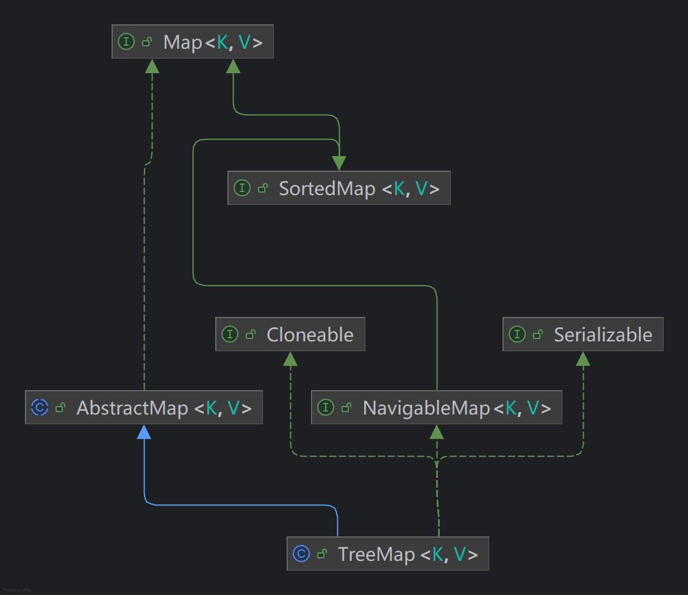

# Java基础

## 一、Hashmap分析

HashMap 是一种基于哈希表的数据结构，它实现了 Map 接口，用于存储键值对 (key-value)。其基本原理如下：

### 1. 哈希表（Hash Table）

HashMap 是基于哈希表实现的，哈希表的基本思想是通过将数据的键值对映射到一个数组的索引位置上来提高数据查找的效率。具体流程如下：

- 哈希函数：
 HashMap 使用哈希函数将键（key）映射到数组的索引位置。哈希函数的目的是通过计算一个值，将不同的键映射到哈希表中的位置。

- 数组：
哈希表内部使用一个数组来存储数据。数组中的每个元素存储一个链表（或者在 Java 8 后是 <RouteLink to="/algorithm/0_base_4_tree#红黑树-balanced-binary-search-tree-bbst">红黑树</RouteLink>），用于处理哈希冲突。

### 2. 哈希冲突
由于哈希函数不可能做到完全唯一的映射，不同的键可能会被映射到相同的索引，这种情况称为哈希冲突。HashMap 通过以下方式解决哈希冲突：

- 链表法（链式哈希）： 在发生冲突的情况下，HashMap 会将冲突的键值对存储到一个链表中（或者 <RouteLink to="/algorithm/0_base_4_tree#红黑树-balanced-binary-search-tree-bbst">红黑树</RouteLink>）。当多个元素映射到同一个索引位置时，它们会形成一个链表。

-  <RouteLink to="/algorithm/0_base_4_tree#红黑树-balanced-binary-search-tree-bbst">红黑树</RouteLink>法：在 Java 8 及以后的版本中，如果链表的长度超过一定阈值（默认为 8），HashMap 会将链表转化为 <RouteLink to="/algorithm/0_base_4_tree#红黑树-balanced-binary-search-tree-bbst">红黑树</RouteLink>，以提高查询效率。

### 3. 扩容机制

当 HashMap 中的元素过多时，哈希表的负载因子（load factor）可能会达到阈值，导致哈希表的存储效率降低。默认情况下，负载因子为 0.75。**当元素个数超过当前容量 * 负载因子时，HashMap 会进行扩容**（通常是原数组大小的 2 倍）。

扩容过程中，所有元素的哈希值会被重新计算，并重新放置到新的数组位置。这是因为**哈希表的大小发生变化，导致原先的索引位置不再适用**。

### 4. 时间复杂度

- 查找、插入、删除操作的时间复杂度：

在理想情况下，哈希表的查找、插入和删除操作的时间复杂度为 O(1)。但是，如果发生哈希冲突，性能会退化到 O(n)（链表长度为 n 时）。使用 <RouteLink to="/algorithm/0_base_4_tree#红黑树-balanced-binary-search-tree-bbst">红黑树</RouteLink>优化后，最坏情况下时间复杂度为 O(log n)。

- 扩容操作的时间复杂度：

扩容是一个相对耗时的操作，时间复杂度为 O(n)，但扩容操作是按需进行的，不是频繁发生，因此平均而言，HashMap 的操作仍然是 O(1)。

### 5. 关键特点
- 非线程安全：HashMap 不是线程安全的，如果在多线程环境下使用，需要考虑同步问题。 
- 允许 null 键和 null 值：HashMap 允许一个 null 键和多个 null 值。 
- 元素顺序不保证：HashMap 不保证键值对的顺序，因为它是基于哈希函数计算索引的，顺序是无序的。如果需要顺序，可以使用 LinkedHashMap

## 二、LinkedHashMap分析

- 类关联图如下所示


## 三、ConcurrentHashMap分析

- ConcurrentHashMap基本特性：

| **特性**	             | **描述**                                                                                      |
|---------------------|---------------------------------------------------------------------------------------------|
| **线程安全**            | 	采用 CAS + 自旋锁 替代 synchronized，减少锁竞争                                                         |
| **高并发**	            | 读操作无锁，写操作局部加锁，避免全局锁的性能瓶颈                                                                    |
| **不支持 null**        | 	key 和 value 都 不能为 null，防止 NullPointerException                                             |
| **比 Hashtable 性能高** | 	Hashtable 使用 synchronized 进行全表加锁，而 ConcurrentHashMap 采用 分段锁机制（JDK 1.7）和 CAS + 自旋锁（JDK 1.8） |

- 在 JDK 1.7 和 1.8 的区别

| **版本**	    | **JDK 1.7**	                   | **JDK 1.8 及以后**              |
|------------|--------------------------------|------------------------------|
| **底层数据结构** | 	Segment（分段锁） + 数组 + 链表        | 	数组 + 链表 + 红黑树（大于 8 个元素）     |
| **加锁方式**	  | 分段锁（Segment 继承 ReentrantLock）	 | CAS + 自旋锁 + synchronized（局部） |
| **并发控制**	  | 多个 Segment 互不影响                | 	CAS 方式优化，减少锁竞争              |
| **写入性能**	  | 分段锁，性能较好                       | 	CAS + 局部锁，性能更高              |
| **扩容机制**	  | Segment 级别扩容	                  | 无锁扩容，支持并发扩容                  |

- 更多细节，如基本结构，及其方法，研究后再写；

## 四、JDK1.8后，ConcurrentHashMap为什么放弃分段锁？

### 1. 分段锁的弊端

#### 🔴 1.1 扩容性能低

JDK 1.7 ConcurrentHashMap 采用 **分段锁（Segment）**，每个 Segment 维护一个独立的 HashEntry[]，但在 扩容 时：
- 需要 **对整个 Segment 加锁**，导致其他线程无法访问该 Segment，影响并发性能。
- **迁移数据需要同步整个 Segment**，多个线程不能同时进行数据迁移。

#### 🔴 1.2 空间浪费

- ConcurrentHashMap 预先分配多个 Segment，即使有的 Segment 为空，仍然占用内存，导致 空间利用率低。

#### 🔴 1.3 结构复杂，代码难维护

- Segment **继承 ReentrantLock，导致 锁管理复杂**，增加了不必要的开销。
- Segment 结构导致 put 操作需要 **两次 hash 计算**（一次计算 Segment 索引，一次计算 Entry 索引），影响性能：
```java
 // 找到 Segment
int segmentIndex = (hash >>> segmentShift) & segmentMask;
// 在该 Segment 内部查找
int bucketIndex = (hash & (segment.table.length - 1));
```

### 2. JDK 1.8 采用的新方案

JDK 1.8 直接去掉 Segment，采用 **数组 + 链表 + 红黑树** 结构，结合 CAS + synchronized 局部锁，实现更高效的并发控制：

#### ✅ 2.1 采用 CAS 无锁优化

- CAS（Compare And Swap） 是一种 乐观锁，当多个线程竞争同一个 Node 插入时，采用 CAS 方式写入，避免不必要的锁竞争：

```java
if (casTabAt(tab, i, null, new Node<K,V>(hash, key, value, null))) {
return null;
}
```
- 这样，当 Node 为空时，线程可以 **无锁写入**，提高吞吐量。

#### ✅ 2.2 采用 synchronized 代替 ReentrantLock

- 由于 synchronized 在 JDK 1.8 中已优化（锁粗化、锁消除、偏向锁等），其性能接近 ReentrantLock，因此 JDK 1.8 直接使用 synchronized 进行局部加锁：
```java
// f 是桶中的第一个节点
synchronized (f) {
putValUnderLock();
}
```
- 只锁定当前桶位（Node[] 数组中的一个索引），避免对整个 Map 加锁，减少竞争。

#### ✅ 2.3 红黑树优化，提升查询性能
- 如果某个桶的链表长度 超过 8，则转换为 红黑树，提升查询效率：
```java
if (binCount >= TREEIFY_THRESHOLD) {
treeifyBin(tab, i);
}
```
- 链表查询 O(n) → 红黑树查询 O(log n)，减少链表查找的性能损耗。

#### ✅ 2.4 支持无锁扩容
- 多个线程可以并发迁移数据，提升扩容效率，避免 Segment 级别的全局锁：
```java
if (sizeCtl < table.length * 0.75) {
transferNodes(); // 进行无锁扩容
}
```
- 采用 **分批次迁移**，多个线程 并行扩容，减少停顿时间。

## 四、HashMap、LinkedHashMap、ConcurrentHashMap分析

| **对比项**             | **HashMap**      | **LinkedHashMap** | **ConcurrentHashMap** |
|---------------------|------------------|-------------------|-----------------------|
| **底层数据结构**          | 哈希表（数组 + 链表/红黑树） | 哈希表 + 双向链表        | 哈希表（分段锁、CAS 机制）       |
| **key 是否有序**        | ❌ 无序             | ✅ 按插入顺序排序         | ❌ 无序                  |
| **时间复杂度**           | O(1) 平均，O(n) 最坏  | O(1) 平均，O(n) 最坏   | O(1) 平均，O(n) 最坏       |
| **是否允许 null key**   | ✅ 允许             | ✅ 允许              | ❌ 不允许                 |
| **是否允许 null value** | ✅ 允许             | ✅ 允许              | ❌ 不允许                 |
| **线程安全**            | ❌ 非线程安全          | ❌ 非线程安全           | ✅ 线程安全                |
| **适用场景**            | 快速查找、无序存储、大量数据   | 需要按插入顺序遍历的场景      | 并发环境下的高效哈希映射          |
| **主要应用**            | 缓存、映射查找、对象存储     | LRU 缓存、访问顺序存储     | 高并发场景，如缓存、线程池         |

## 三、TreeMap分析

### 1、源码分析

- 类关联图如下所示：



- TreeMap 的核心特点

| 特性              | 	说明                                                 |
|-----------------|-----------------------------------------------------|
| 底层实现            | 	 <RouteLink to="/algorithm/0_base_4_tree#红黑树-balanced-binary-search-tree-bbst">红黑树</RouteLink>（Red-Black Tree），是一种自平衡二叉搜索树（BST）               |
| 排序方式            | 	默认按 key 的 自然顺序（Comparable） 排序，也可以传入 自定义 Comparator |
| 时间复杂度           | 	O(log n)（增、删、查）                                    |
| 是否允许 null key   | 	❌ 不允许 null key（会抛 NullPointerException）            |
| 是否允许 null value | 	✅ 允许 null value                                    |
| 是否线程安全          | 	❌ 非线程安全（需要 Collections.synchronizedMap() 保护）       |

::: important 使用途径
适用于需要 "**自动排序**" 和 "**范围查询**" 的场景。
:::


1、适用场景：数据存储时要求按照 key 进行排序，方便后续查询和展示
```java
TreeMap<Integer, String> productMap = new TreeMap<>();
productMap.put(102, "iPhone");
productMap.put(101, "Samsung");
productMap.put(103, "Huawei");

// 遍历时 key 是按顺序排序的（101, 102, 103）
for (Map.Entry<Integer, String> entry : productMap.entrySet()) {
    System.out.println(entry.getKey() + " -> " + entry.getValue());
}
```
2、需要 "范围查询" 或 "区间搜索"
```java
TreeMap<Long, String> transactionMap = new TreeMap<>();
transactionMap.put(1707052800000L, "订单 A");  // 2024-02-05 00:00:00
transactionMap.put(1707139200000L, "订单 B");  // 2024-02-06 00:00:00
transactionMap.put(1707225600000L, "订单 C");  // 2024-02-07 00:00:00

// 获取 2 月 5 日到 2 月 6 日之间的交易
Map<Long, String> result = transactionMap.subMap(1707052800000L, 1707139200000L);
System.out.println(result);
```

### 2、相关类对比
| **对比项**             | **TreeMap**         | **ConcurrentSkipListMap** |
|---------------------|---------------------|---------------------------|
| **底层数据结构**          | 红黑树（Red-Black Tree） | 跳表（Skip List）             |
| **key 是否有序**        | ✅ 有序（按 key 排序）      | ✅ 有序（按 key 排序）            |
| **时间复杂度**           | O(log n)            | O(log n)                  |
| **是否允许 null key**   | ❌ 不允许               | ❌ 不允许                     |
| **是否允许 null value** | ✅ 允许                | ✅ 允许                      |
| **线程安全**            | ❌ 非线程安全             | ✅ 线程安全                    |
| **适用场景**            | 需要排序、范围查询、导航结构      | 并发环境下的有序映射                |
| **主要应用**            | 排名、日志存储、区间查找        | 线程安全的排序映射结构               |


## 四、HashMap和HashTable的区别

| 对比项	           | HashMap	                    | Hashtable                  |
|----------------|-----------------------------|----------------------------|
| **线程安全**	      | ❌ 非线程安全                     | 	✅ 线程安全（方法加锁 synchronized） |
| **性能**	        | 🚀 性能更高（无锁）	                | 🐌 性能较低（加锁导致开销大）           |
| **是否允许 null**	 | ✅ null key/value 允许	        | ❌ null key/value 不允许       |
| **数据结构**       | 	JDK 1.8+: 数组 + 链表/红黑树	     | 数组 + 链表                    |
| **默认初始容量**     | 	16                         | 	11                        |
| **扩容方式**	      | 容量翻倍（2^n 结构优化）              | 	容量翻倍 + 1                  |
| **遍历方式**	      | 迭代器 Iterator（fail-fast 机制）	 | Enumeration（旧版方式）          |
| **适用场景**	      | 适用于 单线程、高性能场景	              | 适用于 历史遗留代码、并发场景（已被淘汰）      |

::: tip
✅ 用 HashMap
- 大多数场景 推荐使用 HashMap，只在单线程环境下使用。

✅ 用 ConcurrentHashMap（代替 Hashtable）
- 如果需要线程安全，**请用 ConcurrentHashMap，不要用 Hashtable！**
- ConcurrentHashMap 在 **高并发 场景下比 Hashtable 性能更优（局部加锁，甚至无锁）**。
:::

## 六、ThreadLocal

### 1、原理及其应用

### 2、Transmittable ThreadLocal
