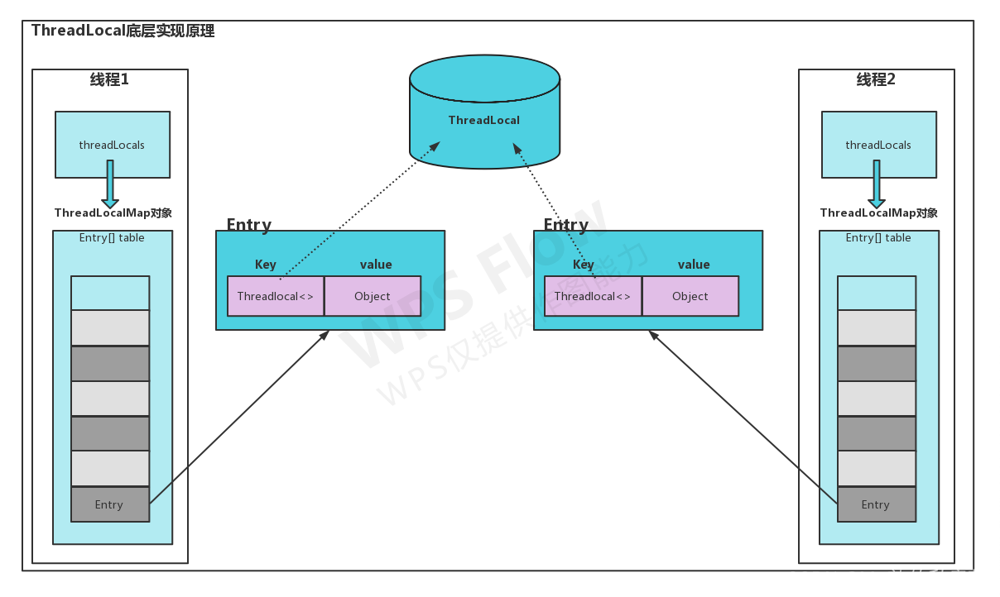
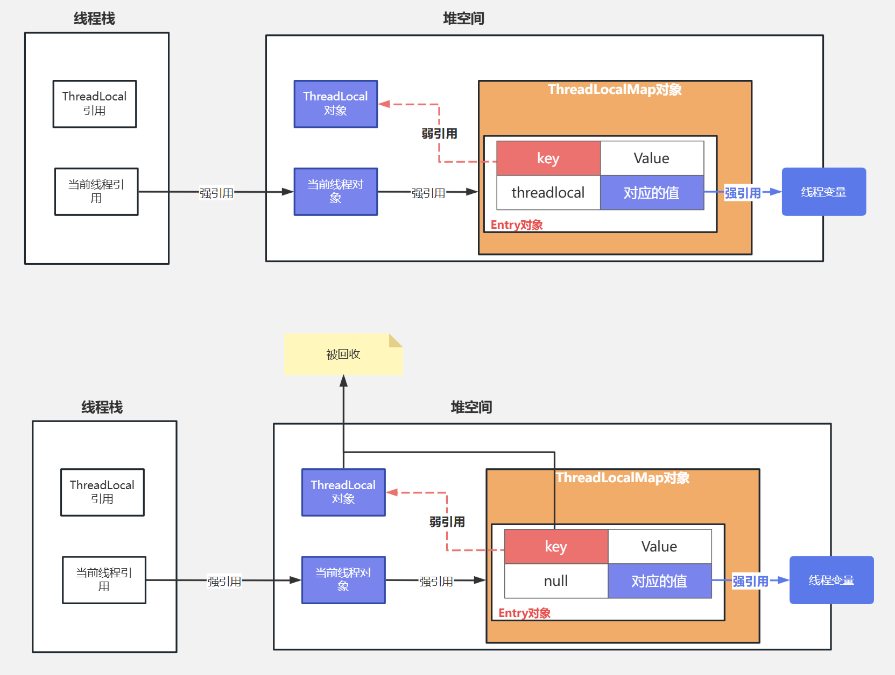

# Java基础

## 一、Hashmap分析

HashMap 是一种基于哈希表的数据结构，它实现了 Map 接口，用于存储键值对 (key-value)。其基本原理如下：

### 1、 哈希表（Hash Table）

HashMap 是基于哈希表实现的，哈希表的基本思想是通过将数据的键值对映射到一个数组的索引位置上来提高数据查找的效率。具体流程如下：

- **哈希函数**： HashMap 使用哈希函数将键（key）映射到数组的索引位置。哈希函数的目的是通过计算一个值，将不同的键映射到哈希表中的位置。

- **数组**： 哈希表内部使用一个数组来存储数据。数组中的每个元素存储一个链表（或者在 Java 8 后是 
<RouteLink to="/algorithm/0_base_4_tree#红黑树-balanced-binary-search-tree-bbst">红黑树</RouteLink>），用于处理哈希冲突。

### 2、 哈希冲突
由于哈希函数不可能做到完全唯一的映射，不同的键可能会被映射到相同的索引，这种情况称为哈希冲突。HashMap 通过以下方式解决哈希冲突：

- **链表法（链式哈希）**： 在发生冲突的情况下，HashMap 会将冲突的键值对存储到一个链表中
（或者 <RouteLink to="/algorithm/0_base_4_tree#红黑树-balanced-binary-search-tree-bbst">红黑树</RouteLink>）。
当多个元素映射到同一个索引位置时，它们会形成一个链表。

-  **<RouteLink to="/algorithm/0_base_4_tree#红黑树-balanced-binary-search-tree-bbst">红黑树</RouteLink>法**： 在 Java 8 及以后的版本中，
如果链表的长度超过一定阈值（默认为 8），HashMap 会将链表转化为<RouteLink to="/algorithm/0_base_4_tree#红黑树-balanced-binary-search-tree-bbst">红黑树</RouteLink>，以提高查询效率。


### 3、  扩容机制

当 HashMap 中的元素过多时，哈希表的负载因子（load factor）可能会达到阈值，导致哈希表的存储效率降低。默认情况下，负载因子为 0.75。
**当元素个数超过当前容量 * 负载因子时，HashMap 会进行扩容**（通常是原数组大小的 2 倍）。

扩容过程中，所有元素的哈希值会被重新计算，并重新放置到新的数组位置。这是因为**哈希表的大小发生变化，导致原先的索引位置不再适用**。

### 4、 时间复杂度

- **查找、插入、删除 时间复杂度**：

在理想情况下，哈希表的查找、插入和删除操作的时间复杂度为 O(1)。但是，如果发生哈希冲突，性能会退化到 O(n)（链表长度为 n 时）。
使用 <RouteLink to="/algorithm/0_base_4_tree#红黑树-balanced-binary-search-tree-bbst">红黑树</RouteLink>优化后，最坏情况下时间复杂度为 O(log n)。

- **扩容操作的时间复杂度**：

扩容是一个相对耗时的操作，时间复杂度为 O(n)，但扩容操作是按需进行的，不是频繁发生，因此平均而言，HashMap 的操作仍然是 O(1)。

### 5、 关键特点

- **非线程安全**：HashMap 不是线程安全的，如果在多线程环境下使用，需要考虑同步问题。 

- **允许 null 键和 null 值**：HashMap 允许一个 null 键和多个 null 值。 

- **元素顺序不保证**：HashMap 不保证键值对的顺序，因为它是基于哈希函数计算索引的，顺序是无序的。如果需要顺序，可以使用 LinkedHashMap

## 二、LinkedHashMap分析

### 1、类继承关系

`LinkedHashMap` 继承自 `HashMap`，是其子类，并复用了 `HashMap` 的大部分方法。

与 `HashMap` 不同的是，`LinkedHashMap` 结合了 **哈希表（HashMap）** 和 **双向链表（LinkedList）** 的特点，不仅提供了高效的键值存储，还维护了元素的 **插入顺序**。

在使用 `Iterator` 遍历 `LinkedHashMap` 时，元素的顺序与插入顺序一致。

此外，`LinkedHashMap` 还支持按照 **访问顺序** 排序，可在构造时通过参数指定，使最近访问的元素排列在前，适用于实现 **LRU（最近最少使用）缓存策略**。


### 2、基本原理

::: warning Todo
更加精通后完成。。。
:::

## 三、ConcurrentHashMap分析

### 1、基本特性

| **特性**	             | **描述**                                                                                      |
|---------------------|---------------------------------------------------------------------------------------------|
| **线程安全**            | 	采用 CAS + 自旋锁 替代 synchronized，减少锁竞争                                                         |
| **高并发**	            | 读操作无锁，写操作局部加锁，避免全局锁的性能瓶颈                                                                    |
| **不支持 null**        | 	key 和 value 都 不能为 null，防止 NullPointerException                                             |
| **比 Hashtable 性能高** | 	Hashtable 使用 synchronized 进行全表加锁，而 ConcurrentHashMap 采用 分段锁机制（JDK 1.7）和 CAS + 自旋锁（JDK 1.8） |

### 2、JDK 1.7 和 1.8 的区别

| **版本**	    | **JDK 1.7**	                   | **JDK 1.8 及以后**              |
|------------|--------------------------------|------------------------------|
| **底层数据结构** | 	Segment（分段锁） + 数组 + 链表        | 	数组 + 链表 + 红黑树（大于 8 个元素）     |
| **加锁方式**	  | 分段锁（Segment 继承 ReentrantLock）	 | CAS + 自旋锁 + synchronized（局部） |
| **并发控制**	  | 多个 Segment 互不影响                | 	CAS 方式优化，减少锁竞争              |
| **写入性能**	  | 分段锁，性能较好                       | 	CAS + 局部锁，性能更高              |
| **扩容机制**	  | Segment 级别扩容	                  | 无锁扩容，支持并发扩容                  |

::: warning Todo
更加精通后完成。。。
:::

## 四、ConcurrentHashMap 为什么放弃分段锁？

### 1、JDK 1.7 前分段锁的弊端

在 JDK 1.7 之前，`ConcurrentHashMap` 使用 **分段锁（Segment）**，每个 `Segment` 管理独立的 `HashEntry[]`。但存在以下问题：

- **扩容性能差**：扩容时需要对整个 `Segment` 加锁，影响并发。

- **内存浪费**：预先分配多个 `Segment`，即使不使用也占用内存。

- **代码复杂**：锁管理复杂，且 `put()` 需要两次 `hash` 计算，降低性能。

### 2、JDK 1.8 后的新方案

JDK 1.8 放弃了 `Segment`，改用 **数组 + 链表 + 红黑树** 结构，结合 **CAS** 和 **synchronized** 局部加锁，提升并发性能。

- **CAS 无锁优化**：避免锁竞争，提高吞吐量。

```java
if (casTabAt(tab, i, null, new Node<K,V>(hash, key, value, null))) {
    return null;
}
```

- **synchronized 局部加锁**：只锁定当前桶位，减少锁竞争。

```java
synchronized (f) {
    putValUnderLock();
}
```

- **红黑树优化**：当链表长度超过 8，转为红黑树，查询效率提高。

```java
if (binCount >= TREEIFY_THRESHOLD) {
    treeifyBin(tab, i);
}
  ```

- **无锁扩容**：多个线程并行迁移数据，提升扩容效率。

```java
if (sizeCtl < table.length * 0.75) {
    transferNodes();
}
```

### 3、整体总结

- JDK 1.7 分段锁的性能差、空间浪费和复杂性问题。

- JDK 1.8 改用 CAS、synchronized 和红黑树，提升了并发性能和查询效率，支持无锁扩容。

---

> **提示**：JDK 1.8 的 `ConcurrentHashMap` 在高并发下表现更优，避免了分段锁带来的性能瓶颈。

---

## 四、HashMap、LinkedHashMap、ConcurrentHashMap对比

| **对比项**             | **HashMap**      | **LinkedHashMap** | **ConcurrentHashMap** |
|---------------------|------------------|-------------------|-----------------------|
| **底层数据结构**          | 哈希表（数组 + 链表/红黑树） | 哈希表 + 双向链表        | 哈希表（分段锁、CAS 机制）       |
| **key 是否有序**        | ❌ 无序             | ✅ 按插入顺序排序         | ❌ 无序                  |
| **时间复杂度**           | O(1) 平均，O(n) 最坏  | O(1) 平均，O(n) 最坏   | O(1) 平均，O(n) 最坏       |
| **是否允许 null key**   | ✅ 允许             | ✅ 允许              | ❌ 不允许                 |
| **是否允许 null value** | ✅ 允许             | ✅ 允许              | ❌ 不允许                 |
| **线程安全**            | ❌ 非线程安全          | ❌ 非线程安全           | ✅ 线程安全                |
| **适用场景**            | 快速查找、无序存储、大量数据   | 需要按插入顺序遍历的场景      | 并发环境下的高效哈希映射          |
| **主要应用**            | 缓存、映射查找、对象存储     | LRU 缓存、访问顺序存储     | 高并发场景，如缓存、线程池         |

## 三、TreeMap分析

### 1、源码分析

- 类关联图如下所示：


- TreeMap 的核心特点

| 特性              | 	说明                                                 |
|-----------------|-----------------------------------------------------|
| 底层实现            | 	 <RouteLink to="/algorithm/0_base_4_tree#红黑树-balanced-binary-search-tree-bbst">红黑树</RouteLink>（Red-Black Tree），是一种自平衡二叉搜索树（BST）               |
| 排序方式            | 	默认按 key 的 自然顺序（Comparable） 排序，也可以传入 自定义 Comparator |
| 时间复杂度           | 	O(log n)（增、删、查）                                    |
| 是否允许 null key   | 	❌ 不允许 null key（会抛 NullPointerException）            |
| 是否允许 null value | 	✅ 允许 null value                                    |
| 是否线程安全          | 	❌ 非线程安全（需要 Collections.synchronizedMap() 保护）       |

::: important 使用途径
适用于需要 "**自动排序**" 和 "**范围查询**" 的场景。
:::


1、适用场景：数据存储时要求按照 key 进行排序，方便后续查询和展示
```java
TreeMap<Integer, String> productMap = new TreeMap<>();
productMap.put(102, "iPhone");
productMap.put(101, "Samsung");
productMap.put(103, "Huawei");

// 遍历时 key 是按顺序排序的（101, 102, 103）
for (Map.Entry<Integer, String> entry : productMap.entrySet()) {
    System.out.println(entry.getKey() + " -> " + entry.getValue());
}
```
2、需要 "范围查询" 或 "区间搜索"
```java
TreeMap<Long, String> transactionMap = new TreeMap<>();
transactionMap.put(1707052800000L, "订单 A");  // 2024-02-05 00:00:00
transactionMap.put(1707139200000L, "订单 B");  // 2024-02-06 00:00:00
transactionMap.put(1707225600000L, "订单 C");  // 2024-02-07 00:00:00

// 获取 2 月 5 日到 2 月 6 日之间的交易
Map<Long, String> result = transactionMap.subMap(1707052800000L, 1707139200000L);
System.out.println(result);
```

### 2、相关类对比
| **对比项**             | **TreeMap**         | **ConcurrentSkipListMap** |
|---------------------|---------------------|---------------------------|
| **底层数据结构**          | 红黑树（Red-Black Tree） | 跳表（Skip List）             |
| **key 是否有序**        | ✅ 有序（按 key 排序）      | ✅ 有序（按 key 排序）            |
| **时间复杂度**           | O(log n)            | O(log n)                  |
| **是否允许 null key**   | ❌ 不允许               | ❌ 不允许                     |
| **是否允许 null value** | ✅ 允许                | ✅ 允许                      |
| **线程安全**            | ❌ 非线程安全             | ✅ 线程安全                    |
| **适用场景**            | 需要排序、范围查询、导航结构      | 并发环境下的有序映射                |
| **主要应用**            | 排名、日志存储、区间查找        | 线程安全的排序映射结构               |


## 四、HashMap和HashTable对比

### 1、经典对比

| 对比项	           | HashMap	                    | Hashtable                  |
|----------------|-----------------------------|----------------------------|
| **线程安全**	      | ❌ 非线程安全                     | 	✅ 线程安全（方法加锁 synchronized） |
| **性能**	        | 🚀 性能更高（无锁）	                | 🐌 性能较低（加锁导致开销大）           |
| **是否允许 null**	 | ✅ null key/value 允许	        | ❌ null key/value 不允许       |
| **数据结构**       | 	JDK 1.8+: 数组 + 链表/红黑树	     | 数组 + 链表                    |
| **默认初始容量**     | 	16                         | 	11                        |
| **扩容方式**	      | 容量翻倍（2^n 结构优化）              | 	容量翻倍 + 1                  |
| **遍历方式**	      | 迭代器 Iterator（fail-fast 机制）	 | Enumeration（旧版方式）          |
| **适用场景**	      | 适用于 单线程、高性能场景	              | 适用于 历史遗留代码、并发场景（已被淘汰）      |

### 2、推荐 ConcurrentHashMap

::: tip
✅ 用 HashMap
- 大多数场景 推荐使用 HashMap，只在单线程环境下使用。

✅ 用 ConcurrentHashMap（代替 Hashtable）
- 如果需要线程安全，**请用 ConcurrentHashMap，不要用 Hashtable！**
- ConcurrentHashMap 在 **高并发 场景下比 Hashtable 性能更优（局部加锁，甚至无锁）**。
:::

## 五、Java 泛型

### 1、<RouteLink to="/interview/0_java#十四、说说你对泛型的理解">泛型基础</RouteLink>

### 2、类型擦除

Java 泛型是编译时的特性，在运行时，Java 会移除（擦除）泛型的类型信息，这称为 **类型擦除（Type Erasure）**。

**原因**： Java 的泛型是为了**向后兼容**（Generics 是 JDK 1.5 引入的，而 Java 需要兼容早期版本）。
**JVM 并不支持真正的泛型**，所有泛型信息在编译阶段就被擦除，JVM 看到的只有原始类型（Raw Type）。

**示例（泛型擦除前 vs. 擦除后）：**
```java
// 泛型代码
public class Box<T> {
    private T value;

    public void setValue(T value) {
        this.value = value;
    }

    public T getValue() {
        return value;
    }
}
```
**编译后（擦除后的字节码）：**

```java
// 擦除泛型后的代码
public class Box {
    // 泛型 T 变成 Object
    private Object value;

    public void setValue(Object value) {
        this.value = value;
    }

    public Object getValue() {
        return value;
    }
}
```

## 六、线程的创建（Thread vs Runnable）

### 1、继承 Thread 类

这种方法需要创建一个自定义的线程类，继承 Thread 类，并重写 run() 方法。
```java
class MyThread extends Thread {
    @Override
    public void run() {
        System.out.println(Thread.currentThread().getName() + ": Hello from thread!");
    }

    public static void main(String[] args) {
        MyThread thread = new MyThread();
        // 启动线程
        thread.start();
    }
}
```
- 优点：简单直观，适合只有一个任务的情况。
- 缺点：如果需要继承其他类，无法再继承 Thread 类（Java 是单继承）。

### 2、实现 Runnable 接口

这种方法更灵活，创建一个实现 Runnable 接口的类，并将其作为参数传递给 Thread 构造函数。
```java
class MyRunnable implements Runnable {
    @Override
    public void run() {
        System.out.println(Thread.currentThread().getName() + ": Hello from Runnable!");
    }

    public static void main(String[] args) {
        MyRunnable task = new MyRunnable();
        Thread thread = new Thread(task);  // 将任务传递给线程
        thread.start();  // 启动线程
    }
}
```
- 优点：允许实现多个接口，提供更多的灵活性和可扩展性。
- 缺点：比继承 Thread 类稍微复杂一些，但通常更加推荐。

## 七、volatile 关键字

### 1、线程可见性

### 2、防止指令重排


## 八、wait() / notify() / notifyAll()


## 九、线程池基础（Executors）

### 1、Executors工具类

`Executors` 是 Java 中用于管理线程池的一个工具类，它是 `java.util.concurrent` 包的一部分。通过 `Executors`，
我们可以轻松地创建和管理线程池，避免手动管理线程的创建和销毁，提高程序的性能和可维护性。

### 2、 `Executors` 的创建方式

```java
//创建一个固定大小的线程池，该线程池可以容纳固定数量的线程。它适用于负载较为稳定的场景，线程数固定。
ExecutorService executor = Executors.newFixedThreadPool(5);

//创建一个可缓存的线程池。该线程池会根据需要创建新线程，如果某个线程长时间没有被使用，它会被回收。
ExecutorService executor = Executors.newCachedThreadPool();

//创建一个单线程的线程池，所有任务会按照提交的顺序依次执行。
ExecutorService executor = Executors.newSingleThreadExecutor();

//创建一个定时任务线程池，支持任务的延迟执行和定期执行。
ScheduledExecutorService executor = Executors.newScheduledThreadPool(5);

//创建一个工作窃取线程池，线程池会自动调整线程的数量，适用于有多个任务需要并发执行的场景。
ExecutorService executor = Executors.newWorkStealingPool();
```

### 3、 `invokeAll()` 和 `invokeAny()`
这两个方法用于执行任务：

- **`invokeAll()`**：将一组任务提交给线程池并等待所有任务执行完成。返回一个 `List<Future>`，表示每个任务的执行结果。

  ```java
  List<Callable<Integer>> tasks = new ArrayList<>();
  tasks.add(() -> { return 1; });
  tasks.add(() -> { return 2; });
  List<Future<Integer>> results = executor.invokeAll(tasks);
  ```

- **`invokeAny()`**：将一组任务提交给线程池，并等待其中任意一个任务完成。返回第一个完成任务的结果。

  ```java
  Integer result = executor.invokeAny(tasks);
  ```

### 4、使用 `Future` 和 `Callable`
当需要获取任务执行结果时，通常会使用 `Future` 和 `Callable`：

- **`Future`**：表示一个异步计算的结果，可以通过 `get()` 方法获取任务执行结果。
- **`Callable`**：类似于 `Runnable`，但是可以返回结果，并且可以抛出异常。

```java
ExecutorService executor = Executors.newFixedThreadPool(2);

Callable<Integer> task = () -> {
    // 执行任务
    return 1 + 1;
};

Future<Integer> future = executor.submit(task);
Integer result = future.get(); // 获取任务执行结果
```

### 5、Executors 总结
`Executors` 类提供了多种类型的线程池，可以根据任务的需求选择不同类型的线程池。合理使用线程池可以提高并发程序的性能，
并且避免了手动管理线程的复杂性，避免了线程创建和销毁的开销。

### 6、为何不建议使用 Executors？
**Executors** 返回的线程池对象的弊端如下:

- **FixedThreadPool** 和 **SingleThreadPool**: 允许的请求队列（**LinkedBlockingQueue**）长度为 **Integer.MAX VALUE**，可能会堆积大量的请求，从而导致 OOM。

- **CachedThreadPool**: 允许的创建线程数量为 **LinkedBlockingQueue**，可能会创建大量的线程，从而导致 OOM。

综上，为了手动控制线程池，建议自己使用 <RouteLink to="/concurrent/1_threadpool">ThreadPoolExecutor</RouteLink> 来创建线程池

## 十、ThreadLocal

### 1、基础原理

ThreadLocal 是 Java 提供的一个类，用于为**每个线程提供独立的变量副本**。每个线程访问自己的副本，不会与其他线程共享数据，常用于处理线程安全的问题。
- 业务使用示意图



- 内部结构示意图：



### 2、应用场景

- **数据库连接**：如低代码系统中的数据源管理；

为每个线程提供独立的数据库连接或事务对象，避免多个线程同时操作同一个连接，提升性能和安全性。

- **用户会话信息**：如单体服务的用户会话信息管理；

在 Web 应用中，可以使用 ThreadLocal 存储每个请求的用户会话信息，使每个线程能够独立地访问相关的会话数据。
